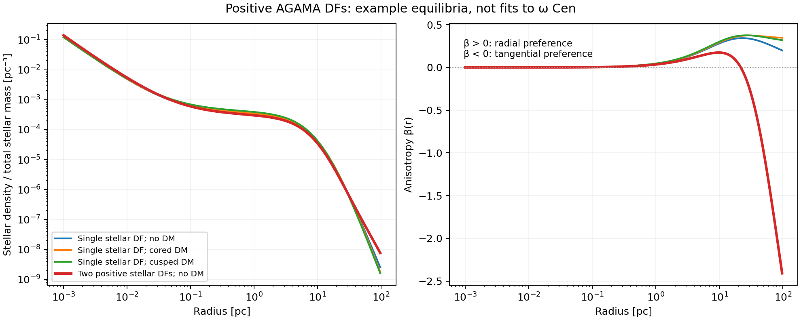
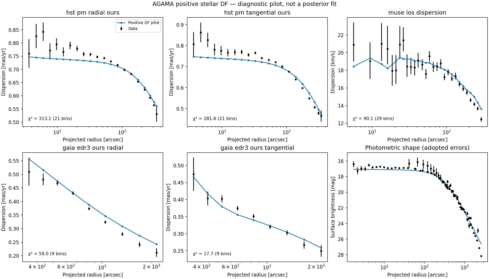

# Positive stellar DF models with AGAMA

The [LaTeX methods note](agama_df_models.tex) and its [compiled PDF](agama_df_models.pdf)
give the full construction, likelihood, numerical checks and pilot results,
with four numbered figures. The PDF lives beside its source; all figure
exports are PNGs in `plots/`.

The [literature review on model choice](DF_MODEL_LITERATURE_REVIEW.md)
reassesses the stellar DF family for a self-gravitating cluster embedded in
possible DM, and distinguishes the current flexible tests from the next
inference model. It includes an ADS-verified bibliography.

The proposed compact stars + DM model has a separate [LaTeX note](compact_df_model.tex)
and [compiled PDF](compact_df_model.pdf). Following review, the primary
candidate is a regularized exponential action DF with an anisotropy transition,
with an embedded lowered-isothermal model as a required independent control.
The halo is sampled in its density at 20 pc and scale radius. Both new stellar
families now have a separate [implementation and numerical test report](REGULARIZED_DF_IMPLEMENTATION.md).
The note describes two
treatments of the unseen mass: prescribed DM/remnant
density profiles for the initial stellar fits, or explicit dark DFs for a
stronger equilibrium construction. Both retain stellar self-gravity in the
common potential. The note separates their validation requirements.

The new branch constructs non-negative stellar distribution functions and
iterates their density and gravity to a common equilibrium. It predicts the
photometric profile, line-of-sight dispersion and both proper-motion components
from that same DF. This is the next modelling stage after the Jeans baselines;
the existing results remain useful benchmarks.

Implementation:
[positive_df.py](../src/ocen_dm/kinematics/positive_df.py),
[df_fit.py](../src/ocen_dm/kinematics/df_fit.py),
[pilot driver](../bin/run_df_pilot.py),
[tests](../tests/test_positive_df.py), and [example configurations](../configs/df/).
The legacy `AgamaDFBackend` remains a separate inversion diagnostic. It is not
used by this branch.

## The distribution function

Each stellar component uses AGAMA's analytic `DoublePowerLaw` action DF,
without rotation, a core modifier, or an exponential action cutoff:

\[
f_i(J_r,L)=C_i
 \left[1+\left(\frac{J_{0,i}}{h_i}\right)^{\eta_i}\right]^{\Gamma_i/\eta_i}
 \left[1+\left(\frac{g_i}{J_{0,i}}\right)^{\eta_i}\right]^{-B_i/\eta_i},
\]
\[
h_i=h_{r,i}J_r+\frac{3-h_{r,i}}{2}L,\qquad
g_i=g_{r,i}J_r+\frac{3-g_{r,i}}{2}L,
\qquad L=J_z+|J_\phi|.
\]

The allowed domain is `J0 > 0`, `steepness > 0`, `slope_in < 3`,
`slope_out > 3`, and `0 < h_r, g_r < 3`. The DF is non-negative throughout
bound action space and has finite mass. Negative inner slopes are allowed.
The isolated zero-action limit can vanish or diverge while remaining integrable.
Unbound phase space has zero DF. AGAMA's `mass=` argument determines the positive
normalization so that each component has the requested total mass; `norm=`
would not do this.

A model may contain several such components with positive fractions summing
to one: `f_star = sum_i f_i`. All share a common potential and a constant
stellar mass-to-light ratio. They are basis components of the same observed
stellar population, not separate catalogue selections. A mixture can have
more complicated radial anisotropy than one component, although its ability
to fit the observed turnover must be established by fitting.

**There is no independently prescribed beta profile.** We derive

\[
\rho_\star(r)=\int f_\star\,d^3v,\qquad
\beta(r)=1-\frac{p_t(r)}{p_r(r)},
\]

where `p_t` is the pressure in one tangential direction. The action coefficients
are not beta values. Density, anisotropy and the velocity distributions must
remain mutually consistent as their parameters change. In particular, we do
not hold the old central MGE core fixed in the presence of a point-mass BH.

The construction and parameter conventions follow the
[AGAMA manual, spheroidal DFs](https://github.com/GalacticDynamics-Oxford/Agama/blob/master/doc/reference.tex)
and [Vasiliev's AGAMA paper](https://arxiv.org/abs/1802.08239).

## Gravity, integration and numerical checks

The potential contains the live stellar DF, an optional Plummer remnant
component, an exact unsoftened point-mass BH, and an optional truncated gNFW
halo. The halo has the same density law as the Jeans branch, normalized by
`M_dm_100`; `gamma=0` and `gamma=1` give the supplied core and cusp examples.
The static halo/remnant densities are positive, but this implementation does
not assign them DFs. Stellar DF positivity is therefore the guarantee here.

The iterative solver uses AGAMA for action evaluation, analytic DFs and the
spherical multipole potential. A positive Gauss–Legendre velocity quadrature
computes stellar density and pressures:

\[
\rho=4\pi\int_0^{v_{\rm esc}}v^2\,dv\int_0^1 f\,d\mu,
\quad \mu=|v_r|/v,
\]

with factors `v^2 mu^2` and `v^2(1-mu^2)/2` for radial and tangential
pressures. Updating the potential from this density and repeating gives the
self-consistent stellar model. Both density and total force must converge;
a dominant static component cannot conceal an unconverged stellar density.

An initial test of AGAMA's `SelfConsistentModel` helper produced a discrepancy
of about 11% near 0.008 pc between its interpolated stellar density and a fresh
DF integral, confirmed with independent velocity quadrature. The explicit
iteration above avoids this discrepancy in the tested models. It also makes
the radial and velocity resolutions independently controllable; this is not
a change to the installed AGAMA library.

Defaults: 160 potential nodes over `1e-4–1e5 pc`, 64 nodes in each velocity
coordinate, 240 intrinsic-moment nodes and 128 projection nodes. Iteration
stops below a maximum fractional density/force change of `5e-4`, within at
most 50 iterations. Acceptance also requires:

- density closure below 0.5%, evaluated between grid nodes in the final
  potential with twice the velocity quadrature order;
- stellar mass closure below 0.5%;
- finite, positive densities and pressures, with no clipping of invalid values.

Projection integrates the DF-derived pressures using `r = R cosh(u)`. It does
not solve Jeans again. The driver independently compares the result with native
`GalaxyModel.moments` projected integrals, then rebuilds the entire model with
twice the grid/quadrature sizes and a tighter iteration tolerance. Its validation
flag requires projected surface-density/pressure agreement within 0.5% and
changes in every predicted dispersion below 0.1 times its observational error.
These are numerical checks, not goodness-of-fit criteria. Very extreme DF
parameters may need larger grids or quadrature orders and can be rejected.

Units are pc, solar masses, km/s and pc km/s. The unit guard refuses to change
an existing incompatible global AGAMA unit system. Use a fresh Python process
when switching from unrelated AGAMA calculations.

## Joint data objective and limitations

The driver replays the saved 89-bin dataset: 21 HST radial, 21 HST tangential,
29 MUSE LOS, nine Gaia radial and nine Gaia tangential bins. It preserves the
actual stellar radial quantiles, annular weighting, proper-motion conversion,
asymmetric errors and split-normal likelihood. No instrument scales are fitted
in these examples.

The composite photometric profile is fitted jointly with the kinematics.
One common magnitude zero-point is profiled out, so its absolute normalization
does not impose a stellar mass. The existing composite profile supplies relative
weights rather than calibrated errors. The diagnostic examples explicitly adopt
`sigma_mu = 0.1 mag / sqrt(weight)` and discard zero-weight entries. This choice
sets the relative influence of photometry. It does not model splice covariance
or claim that these are measured photometric errors. A snapshot can instead
supply explicit per-point errors.

The pilot minimizes `chi2_kinematics + chi2_photometry`. Both terms and all
per-dataset contributions are saved separately. The optimizer bounds are search
bounds, not a fully specified inference prior. The profiled photometric
zero-point, error calibration, distance prior and mixture priors must be settled
before computing posterior probabilities or evidences for these families.
Existing Jeans evidences do not apply to this changed model.

For continuity with the baseline data treatment, the current branch subtracts
the saved published streaming variance from its projected even second moments.
An impossible subtraction is rejected rather than floored. This is a
moment-level rotation approximation: a rotating odd DF has not been fitted,
and positivity of the even DF alone does not establish that it can reproduce
every observed mean streaming velocity. The first version is spherical,
single-M/L and in equilibrium. Rotation, flattening, mass segregation, live
remnant/DM DFs, dynamical stability and tidal survival remain distinct extensions.

## Running and reproducing a pilot

Activate the project environment, with AGAMA installed, then run:

```bash
python bin/run_df_pilot.py \
  --config configs/df/no_dm.json \
  --out results/df/my_no_dm_pilot \
  --sigma-mag 0.1 \
  --max-evaluations 96
```

Omit `--max-evaluations` for a fixed-parameter evaluation and numerical checks.
The supplied no-DM/core/cusp configurations expose six search coordinates;
the remnant parameters and distance are fixed in this initial pilot. Other
physical parameters can be exposed through `fit_coordinates` using config
paths such as `M_dm_100`, `M_rem` or `components.1.J0`. The two-component
configuration also fits its mixture weight, second action scale and second
outer orbital-weight coefficient. A coordinate `mixture_log_ratio.i` means
`ln(fraction_i / fraction_0)` for `i >= 1`; a softmax maps these coordinates
to strictly positive fractions summing to one. Raw fractions cannot be varied
independently in the optimizer.

For replay, supply `--photometry-snapshot PREVIOUS_RUN/photometry.json` and
`--data-run PREVIOUS_RUN` rather than reloading the photometric catalogue.
To evaluate a saved best model, put its `best_model.json` content under the
`model` key of a driver configuration and use no optimizer calls.

Every run requires a fresh output directory and saves the actual kinematic and
photometric arrays, configuration, source hashes/copies, per-evaluation record,
best parameters, convergence diagnostics and a status record. The driver also
records the AGAMA version and extension-binary hash. A bounded optimizer reaching
its evaluation limit is explicitly reported as unconverged. No posterior
sampling or replacement of existing Jeans runs occurs in this driver.

Figures are PNGs in `plots/`; plotted arrays and provenance are JSON in
`results/plot_data/`; working products live in `results/df/`.

## First validation and fitting exercise: 22 September 2026

All **94 focused tests passed**: 23 new DF tests and 71 existing consistency,
anisotropy and run-replay tests. Controls include an analytic isotropic Kepler
DF, an independent Jeans-equation check, radial integration of the stellar
mass, halo force/normalization checks, exact BH gravity, mixture positivity,
unit protection, bound/unbound phase space, photometric normalization and
the existing data-bin/streaming conventions.

Four end-to-end fixed-parameter examples passed both independent projection
and full resolution-doubling checks. These starting parameters were chosen to
exercise the code and are not fitted alternatives:

| Example | Maximum density closure error | Stellar mass closure error | Largest refined dispersion shift / data error |
|---|---:|---:|---:|
| Single stellar DF, no DM | 0.0288% | 0.000439% | 0.00060 |
| Single stellar DF, cored DM | 0.0580% | 0.000386% | 0.00853 |
| Single stellar DF, cusped DM | 0.0463% | 0.000434% | 0.00066 |
| Two stellar DFs, no DM | 0.0449% | 0.000204% | 0.01087 |

The two-component example produces beta of approximately +0.14 at 5 pc,
+0.04 at 20 pc and −1.0 at 50 pc. Thus a positive mixture can produce radial
anisotropy followed by a tangential outer region. This demonstrates the
family's flexibility, without establishing which profile the data favour.



A bounded no-DM pilot then exercised joint fitting on all 89 kinematic bins
and the composite photometric profile. After 96 objective calls (about five
minutes), kinematic chi-squared fell from 15,881.77 to **761.52**, and the
photometric contribution from 2,090.90 to **662.30**. The optimizer reached
its evaluation budget, **not convergence**. Its best joint objective is
1,423.82; it does not necessarily minimize the kinematic contribution alone.
The stellar/remnant mass split and DF shape still need a proper search.
The remaining inner HST and photometric residuals are evident in the plot.
This pilot is neither a replacement best fit nor a measurement of the cost
of imposing DF positivity.

The pilot itself passed the numerical checks: maximum density closure error
0.0358%, native projected-integral discrepancy 0.0647%, and largest refined
dispersion shift 0.00851 data errors. Its large residuals are therefore model
and fitting issues, not resolved by simply increasing quadrature resolution.
A fresh-process replay from its saved model and data reproduces the joint
objective, every kinematic prediction and the photometric prediction exactly.



Machine-readable results are in
[`results/df/pilot_no_dm_20260922/summary.json`](../results/df/pilot_no_dm_20260922/summary.json),
the four `results/df/validation_*_20260922/` directories, and
[`results/plot_data/df_validation_profiles.json`](../results/plot_data/df_validation_profiles.json).
The figures were inspected. The subsequent
[independent flexibility challenge](DF_CAPACITY_CHALLENGE.md) tests one, two
and three positive light DFs in the known potential of separately constructed
equilibrium mocks. Three components reproduce all three mock cases below the
predefined 0.1-RMS/0.3-maximum error target; one and two components miss that
strict target even with wider search bounds. This tests light-DF capacity at
fixed gravity, not component mass recovery. The
[free-potential mass-recovery stage](DF_MASS_RECOVERY.md) now implements distinct
stellar mass/light weights and runs noiseless controls before gated noisy mock
experiments. Its [status page](DF_MASS_RECOVERY_STATUS.md) tracks the active batch.
These controls precede new posterior fits of the real observations.
