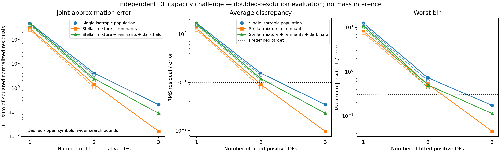
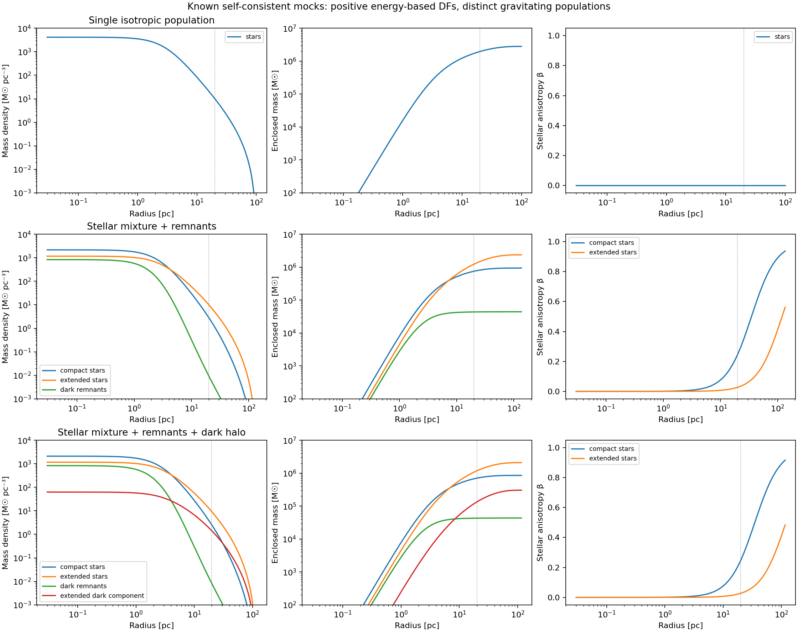
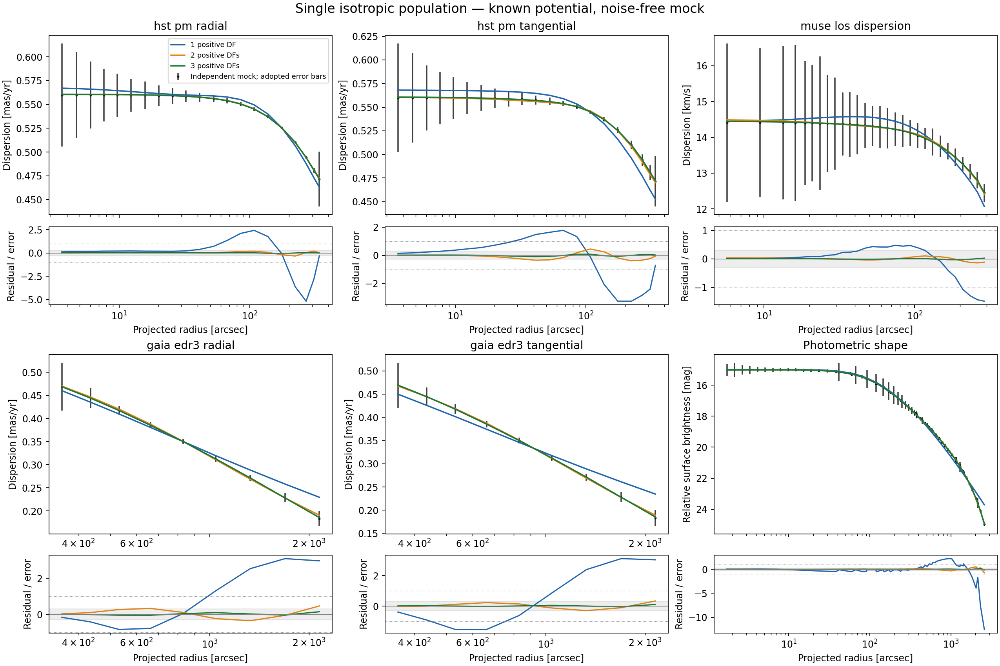
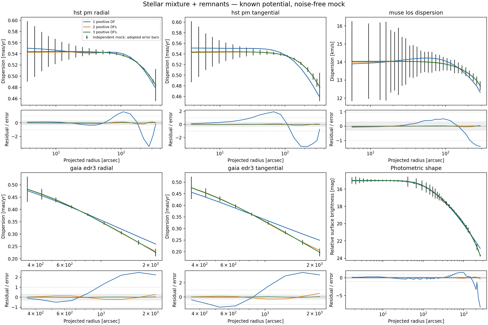
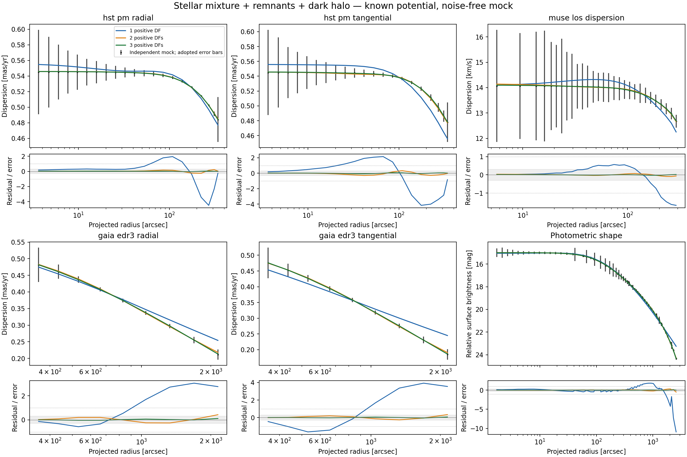

# Independent DF flexibility challenge

This experiment asks whether the positive action-DF family can reproduce the
projected light and velocity moments of an independently constructed equilibrium
cluster **when its true gravitational potential is supplied**. It is the first
stage of the proposed mock-recovery programme. Mass recovery, noisy posterior
coverage and fits to the real data are separate subsequent stages.

## Independent physical truth

The truth generator is `src/ocen_dm/kinematics/df_mock.py`. It solves Poisson's
equation for several positive energy-based DFs, independently of the fitted
AGAMA DoublePowerLaw action family. Each population has

\[
 f_i(Q_i)=A_i[\exp(Q_i/s_i^2)-1]\quad(Q_i>0),\qquad f_i=0\quad(Q_i\leq0),
\]

\[
 Q_i=\Phi(r_t)-E-\frac{L^2}{2r_{a,i}^2},\qquad
 \beta_i(r)=\frac{r^2}{r^2+r_{a,i}^2}.
\]

The isotropic limit is `anisotropy_radius_pc=None`. The zero outside the allowed
energy domain is part of the analytic DF definition; no negative inversion is
clipped. Every gravitating component, including dark remnants and the optional
halo, has a positive DF in the same self-consistent potential. These are
collisionless equilibria; stability and survival in a Galactic tide have not
been tested. There is no central point mass or rotation in this first challenge.

Writing `W=Psi/s_i^2`, the density and radial pressure follow independent
analytic velocity integrals:

\[
 \rho_i=\frac{A_i(2\pi s_i^2)^{3/2}}{1+r^2/r_{a,i}^2}K_0(W),\quad
 p_{r,i}=\frac{A_i(2\pi s_i^2)^{3/2}s_i^2}{1+r^2/r_{a,i}^2}K_1(W),\quad
 p_{t,i}=\frac{p_{r,i}}{1+r^2/r_{a,i}^2}.
\]

Here `p_t` is one tangential pressure component. For numerical stability near
the edge, the code evaluates

\[
 K_0(W)=\frac{8W^{5/2}}{15\sqrt\pi}\,{}_1F_1(1;7/2;W),\qquad
 K_1(W)=\frac{16W^{7/2}}{105\sqrt\pi}\,{}_1F_1(1;9/2;W).
\]

The ordinary differential equations `dPsi/dr=-GM(<r)/r^2` and
`dM_i/dr=4 pi r^2 rho_i` are integrated to their first `Psi=0` boundary. The
external potential is the Kepler potential of the resulting finite mass.
AGAMA receives a spherical multipole representation of this independently
computed total density; its forces and potential are checked against the ODE.

Three cases use central dimensionless potential 7, reference radius 3 pc and
velocity scale 15 km/s:

| Case | Gravitation and stellar populations | Total mass | Truncation radius |
|---|---|---:|---:|
| `single_isotropic` | One isotropic luminous population | 2.8033 million solar masses | 101.13 pc |
| `mixed_no_dm` | Compact and extended stars, concentrated dark remnants | 3.3516 million solar masses | 137.29 pc |
| `mixed_with_dm` | The same kinds of populations plus an extended dark component | 3.2845 million solar masses | 117.49 pc |

The mixture populations have velocity-scale ratios 0.90 and 1.12 and anisotropy
radii 35 and 120 pc. Their light per unit mass is 1 and 0.7 in arbitrary common
units. Remnants have velocity-scale ratio 0.65 and zero light; the halo has ratio
1.5 and zero light. Their normalizations are specified by **central density
fractions**, not total mass fractions. In the halo case, the resulting masses
are 0.856 and 2.082 million solar masses in stars, 43,340 solar masses in remnants
and 304,041 solar masses in the halo. All cases and component masses are saved
in `truth.json`. These are controlled test clusters, not inferred models of
Omega Centauri.

This independent mock strategy follows the rationale of
[Hénault-Brunet et al. (2019)](https://arxiv.org/abs/1810.05167), who compared
cluster mass-modelling methods against N-body mock observations. The present
energy-based generator is an explicit Osipkov–Merritt construction; it is not
the LIMEPY implementation or an N-body realization.

## Observations and fitting

The challenge uses the saved radial nodes, annular averaging, distance and
error scales of the DF pilot: 89 kinematic bins across HST radial/tangential,
MUSE LOS and Gaia radial/tangential profiles, plus 82 photometric points.
The original measured values are replaced by exact projected mock expectations.
No random noise or published streaming subtraction is applied: both the mock
and fitted even DF are nonrotating. Kinematic weighting uses the mean of the
saved lower and upper errors. The photometric scale remains the explicit pilot
choice, `0.1 mag / sqrt(relative weight)`, with one profiled common zero point.
Consequently the joint sum `Q` is a diagnostic approximation score, not a
calibrated chi-squared probability, evidence or model-selection statistic.

All five kinematic profiles sample the **same luminosity-weighted stellar
mixture**. Different luminosity and mass weights are present in the physical
truth, but differences in population selection between instruments are not
introduced in this first stage. At fixed potential the combined light DF is
itself positive and stationary. Matching it does not require the fitted basis
components to correspond one-to-one to physical populations.

The fitter in `src/ocen_dm/kinematics/df_capacity.py` uses one, two and three
positive DoublePowerLaw shapes. Each has six free shape coordinates: `ln J0`,
inner and outer slopes, `ln steepness`, and inner and outer radial-action
coefficients. Positive mixture weights contribute `N-1` log ratios, giving
6, 13 and 20 fitted coordinates. These are fractions of the light density at
1 pc, not fractions of gravitating mass. The overall light normalization is
unconstrained after profiling the photometric zero point.

Actions are cached in the fixed true potential. Velocity integration generates
the density and pressure fields; projection and the saved observational binning
produce the fitted quantities. Analytic derivatives pass finite-difference
checks through the entire calculation. A candidate DF does **not** replace the
known mass density or update the potential in this experiment.

Each fit uses three initial conditions and bounded nonlinear least squares,
with at most 600 objective evaluations per start. The first start at the next
mixture size splits a component of the previous solution, with a small
perturbation to separate the two shapes. Two independent starts check other
solutions. Evaluation histories, termination messages, boundary contacts,
source copies/checksums, AGAMA binary hashes and complete input snapshots are
preserved in fresh result directories.

The original bounds are `J0=5–3000 pc km/s`, inner slope `-3–2.5`, outer slope
`3.6–25`, steepness `0.3–8` and action coefficients `0.15–2.85`. Fits contacting
these limits motivate a separate wider-bound control for one and two DFs:
`J0=0.5–100000`, inner slope `-6–2.8`, outer slope `3.3–60`, steepness `0.15–12`
and coefficients `0.01–2.99`. Positive fractions use log ratios in `[-10,10]`
in both versions. Bounds are search limits, not Bayesian priors.

The pass criterion was set before fitting: RMS discrepancy below 0.1 adopted
errors and no individual bin above 0.3 errors, evaluated again at doubled
numerical resolution. Numerical validation requires a maximum prediction
shift below 0.05 errors after resolution doubling, below 0.05 errors after
doubling the outer integration radius, below 0.5% difference from native
AGAMA adaptive projected moments, mock projection changes below 0.001 errors,
and force agreement better than one part in 100,000.

## Results

All three mock cases meet the predefined accuracy target with three positive
DFs. The table uses the independent doubled-resolution evaluation of each
saved best fit, with the original search bounds.

| Independent mock | Q, one DF | Q, two DFs | Q, three DFs | Three-DF RMS / error | Three-DF worst bin / error |
|---|---:|---:|---:|---:|---:|
| Single isotropic population | 485.384 | 4.149 | 0.2045 | 0.0346 | 0.1735 |
| Mixed stars + remnants | 293.796 | 1.419 | 0.0163 | 0.0098 | 0.0452 |
| Mixed stars + remnants + halo | 466.941 | 2.451 | 0.0910 | 0.0231 | 0.1135 |

The wider-bound checks improve the one- and two-DF solutions, but neither
passes the same strict target:

| Independent mock | Wide-bound Q, one DF | Wide-bound Q, two DFs | Two-DF RMS / error | Two-DF worst bin / error |
|---|---:|---:|---:|---:|
| Single isotropic population | 428.547 | 3.446 | 0.1419 | 0.6260 |
| Mixed stars + remnants | 261.075 | 1.072 | 0.0792 | 0.4513 |
| Mixed stars + remnants + halo | 407.566 | 2.103 | 0.1109 | 0.4475 |

There were 45 optimization starts and 6,605 objective evaluations across the
main challenge and boundary controls. Forty-four starts met an optimizer
termination criterion. One three-DF start in the no-halo mixture exhausted
600 calls at Q=0.0570; two other starts found better solutions, and the selected
fit met a termination criterion. The three-DF solutions demonstrate attainable
accuracy even though their shape parameters are not unique and some contact
the search bounds. The result does not require proof of a global optimum.

Several one-DF parameters still contact the wider limits. Thus the experiments
show poor performance of one DF in both tested search domains, not a proof
that every possible member of the unbounded analytic family fails. Two DFs
already give sub-error residuals; their failure here refers specifically to
the stricter 0.1-RMS/0.3-maximum target, not to a statistical rejection against
noisy observations.

All 15 selected models passed the numerical controls. The largest change after
doubling resolution was 0.0116 adopted errors, in a wide-bound one-DF fit; the
three-DF fits changed by at most 0.0035 errors. Their approximation residuals
therefore remain below the predefined target after numerical refinement.
The 104 focused tests passed, covering the new challenge and the existing
positive-DF, consistency, anisotropy and replay controls.

**Interpretation.** A three-component positive light DF is sufficiently flexible
for these independent, finite-radius mock clusters at the adopted observational
precision. The improvement also occurs for a truth containing only one stellar
population. The fitted components supply shape flexibility: they are not a
count of physical stellar populations or sources of gravity. Much of the
single-DF mismatch appears in the outer profile curvature and the tightly
measured HST bins; the plots show both the profiles and normalized residuals.

The supplied true potential already contains the correct stellar, remnant and
halo gravity. These tests therefore do not measure any component mass and do
not establish unbiased DM recovery. They also do not validate the production
model's assumption that stellar mass follows the same weighted DF as light.
The [mass-recovery stage](DF_MASS_RECOVERY.md) now separates stellar mass/light
weights and fits the mass distribution, with noiseless controls preceding
noisy realizations. Instrument-specific
population selection, rotation, flattening and nonequilibrium effects remain
separate tests; passing this first challenge is evidence of capacity within
its stated scope.

### Figures and saved products

Figure 1 compares the approximation errors for all cases. Solid curves use
the original bounds and open symbols/dashed lines the wider controls. Dotted
lines mark the predefined RMS and worst-bin targets. Values are from the
doubled-resolution evaluation.



Figure 2 shows the true component densities, enclosed masses and stellar
anisotropies; the vertical dotted line marks 20 pc.



Figures 3–5 compare the original-bound best fits with each independent mock
at the actual observational bins. The grey residual band is ±0.3 adopted
errors. Error bars show the precision used for weighting; the mock points
themselves have no added random noise. These curves use the optimization
grid, whose separate numerical validation is reported above.







Main runs are in `results/df/capacity_20260922_{single_isotropic,mixed_no_dm,mixed_with_dm}/`.
Wider-bound controls are in the corresponding `capacity_wide_20260922_*`
directories. Every run has a completed manifest, per-start records, full
evaluation histories, a physical truth specification and preserved input/code
snapshots. The combined plotted arrays and source checksums are in
[`results/plot_data/df_capacity_20260922.json`](../results/plot_data/df_capacity_20260922.json).
The verification record is in
[`results/diagnostics/df_capacity/verification.json`](../results/diagnostics/df_capacity/verification.json).

## Reproduction

Use the project Python environment with AGAMA installed and one numerical
thread per process. For example:

```bash
OMP_NUM_THREADS=1 OPENBLAS_NUM_THREADS=1 VECLIB_MAXIMUM_THREADS=1 \
PYTHONDONTWRITEBYTECODE=1 MPLCONFIGDIR=/private/tmp/ocen-df-mpl \
python bin/run_df_capacity.py --case mixed_with_dm \
  --out results/df/new_capacity_mixed_with_dm --starts 3 --max-evaluations 600
```

Existing run directories are refused. A boundary check can use
`--wide-bounds --components 1 2 --initial-run <original-run>` with a fresh
output directory. `bin/plot_df_capacity.py --runs <completed-run-directories> --controls <wide-bound-run-directories>`
generates PNGs under `plots/` and plotted arrays/checksums under
`results/plot_data/`. The numerical products remain in `results/df/`.

The test suite includes analytic energy-DF integrals checked against direct
velocity integration; radial mass integrals and force checks; native AGAMA DF
and projection comparisons; derivatives for all mixture sizes; exact saved
binning/unit conversion; invariance to a common light normalization; and an
optimizer recovery control generated within the fitted family. The latter is
only an implementation check, distinct from the independent physical challenge.
