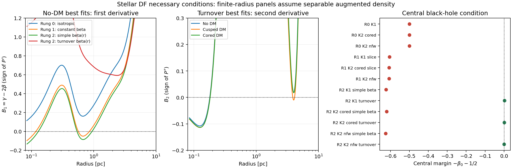

# Spatial density and stellar DF consistency

This audit checks all archived Jeans runs and reruns, including interrupted
attempts and the recent fixed-density optimizations. Its purpose is to separate
positive spatial density, necessary conditions for a physical stellar model,
and an actual proof that a non-negative distribution function exists.

The subsequent [AGAMA DF branch](AGAMA_DF_MODELS.md) constructs positive stellar
DFs and fits their density and kinematics jointly. It has numerical validation
and a bounded fitting pilot; it does not retroactively certify the Jeans models
audited here.

## Results on 22 September 2026

All audited spatial densities are non-negative. The scan covers 29 run records:
24 completed fits (including the invalid old solver archive), one diagnostic
smoke run, two interrupted attempts, and two active posterior runs. It checks
358,746 saved posterior rows, or 103,468 distinct parameter vectors, plus 800
checkpoint live points. All 7,202 archived mass-profile draws replay exactly.
The two active runs have no completed posterior and remain pending.

Among the 23 completed fits outside the invalid archive, 20 best samples fail
the central black-hole condition. These include rung 0, rung 1, simple-beta
rung 2, and the earlier fits/presets. Every saved posterior draw in these 20
runs fails the same central condition. The three turnover rung-2 runs pass
this central necessary condition by construction.

All three turnover best samples nevertheless fail the second-derivative
condition under the separable augmented-density assumption:

| Turnover model | Negative B₂ intervals on observed radial scales [pc] | Posterior fraction failing the separable screen (512–2,048 points) |
|---|---|---:|
| No DM | 0.0850–0.1801 | 89.66% |
| Cusped DM | 0.0850–0.1819; 3.880–4.125 | 89.80–89.91% |
| Cored DM | 0.0852–0.1823 | 86.81–86.92% |

The minima near 0.125 pc are −0.108, −0.114 and −0.113, respectively,
well below numerical tolerance. These failures concern the proposed separable
DF, not merely an asymptotic limit at the origin. The remaining posterior
samples pass these screens but have not been shown to possess a positive DF.
The range in the last column is grid sensitivity, not a statistical error bar.

All 27 free/fixed-density profile optima and three saved repeat-start optima
also pass the central bound but fail the separable screen. The failure appears
with and without a dark halo and across the tested DM densities; it is not a
discriminator that rules out high DM alone.

Thus the spatial-density question has a positive answer for every reconstructed
model. No completed fit is certified here as having a non-negative stellar DF
everywhere: the simpler fits fail their unmodified central extrapolation, while
the turnover fits require a different DF construction or changes to their
fitted density/anisotropy before such a claim can be made. A nonseparable DF
remains an open possibility for the turnover fits. The stored likelihoods and
posterior weights are not changed by this audit.



For each component, a non-negative distribution function guarantees a
non-negative spatial density:

\[
\rho(r)=\int f(r,\mathbf v)\,d^3v.
\]

Positive density alone does not imply a positive DF. Our stellar MGE, remnant
Plummer profile and truncated halo have non-negative coefficients and positive
scales. The black hole contributes a positive point mass at the origin. Their
spatial densities are therefore non-negative by construction, throughout the
aperture and beyond it. The audit also evaluates the smooth density numerically
for every saved posterior sample.

The Jeans fits specify the stellar density, anisotropy and potential, and solve
for velocity moments. They do not uniquely specify a stellar DF. Nor do they
specify the velocity distributions of the dark halo or remnants. A successful
stellar check would therefore leave those components and the realization of
the adopted rotation to be checked separately.

## Products and coverage

- [Every run and optimization](../results/plot_data/df_consistency_inventory.md)
- [Machine-readable results, intervals, fractions and input hashes](../results/plot_data/df_consistency_audit.json)
- [Diagnostic figure](../plots/df_consistency_audit.png)
- Reproducible driver: `bin/audit_df_consistency.py`
- Per-draw flags and multiplicities: `results/diagnostics/df_consistency/`

The inventory includes the invalid old solver archive and the conditional-fit
smoke test, clearly excluded from scientific conclusions. Interrupted attempts
have a saved proposal and live-point cloud, which are checked as checkpoints,
not treated as completed posteriors. Active fits without completed samples
remain pending; rerunning the driver incorporates them when finished.

Every unique saved posterior vector is checked, with its original multiplicity
used for percentages. These percentages measure failures within the archived
posterior. They are not new model probabilities or corrected evidences.

Legacy models lack full model/data snapshots. Their reconstructed component
masses and total density are checked against **every archived profile draw**.
Several old likelihoods no longer reproduce under the current likelihood/data
code; the JSON records this separately. Reproducing their physical profiles does
not validate comparisons of their evidences with later runs.

## Central condition, without the separability assumption

For a spherical stellar population around a central point-mass black hole,
non-negative regular equilibrium DFs require

\[
\gamma_0\geq\beta_0+\tfrac12,
\qquad \gamma=-\frac{d\ln\nu}{d\ln r}.
\]

Every fitted MGE has a finite-density centre, hence \(\gamma_0=0\), and every
audited model contains a positive, unsoftened black hole. The condition is
therefore \(\beta_0\leq-1/2\). It is a necessary condition, not a sufficient
one. See [An & Evans (2006)](https://arxiv.org/abs/astro-ph/0511686).

A failure concerns the model extrapolated to arbitrarily small radii. It does
not locate a negative DF at a particular observed bin. Modifying the unresolved
stellar core or central anisotropy could change this conclusion, but would
change the model. These fits remain diagnostic baselines for the measured
velocity moments.

## Finite-radius conditions under a stated DF construction

For a more restrictive check, assume a separable augmented density

\[
\widetilde\nu(\Psi,r^2)=P(\Psi)R(r^2),\quad
P[\Psi(r)]=\nu(r)g(r),\quad
g(r)=\exp\left(2\int^r\frac{\beta(t)}t\,dt\right),\quad R=1/g.
\]

This assumption supplies information beyond the fitted Jeans moments. Within
this class, \(P'\geq0\) is necessary for \(\beta_0\leq1/2\), and
\(P''\geq0\) for \(\beta_0\leq-1/2\). Radial derivatives must also satisfy
\(R_n=d^n[x^nR(x)]/dx^n\geq0\), where \(x=r^2\). The audit checks
\(R_2\), in addition to the potential derivatives. These are finite subsets
of the necessary conditions in
[An, Van Hese & Baes (2012), sections 4.1–4.2](https://arxiv.org/abs/1202.0004).

For reproducibility, set \(S=-\gamma+2\beta\),
\(q=4\pi r^3\rho_{\rm smooth}/M(<r)\), and \(F=GM(<r)/r^2\).
Differentiating the expression for \(P\) gives

\[
P'=\frac{P}{rF}B_1,\quad B_1=\gamma-2\beta,
\]
\[
P''=\frac{P}{r^2F^2}B_2,\quad
B_2=S^2+S-\frac{d\gamma}{d\ln r}
       +2\frac{d\beta}{d\ln r}-Sq,
\]
\[
\frac{R_2}{R}=(1-\beta)(2-\beta)-\frac12\frac{d\beta}{d\ln r}.
\]

The prefactors are positive. The implementation computes analytic MGE and
anisotropy derivatives, avoiding numerical differentiation of the fitted
potential. The black hole enters enclosed mass but not the smooth density.
The second-derivative condition is **not applied** to the isotropic,
constant-beta or simple-beta fits whose central beta exceeds −1/2.

Failure excludes a non-negative DF **in this separable class**. It does not
exclude every possible nonseparable DF with the same density and second
moments. Passing the screens is recorded as “no failure found,” never as a
certificate of a non-negative DF. No negative DF is clipped or replaced.

## Aperture and numerical limits

The outer radius is each run's largest projected bin edge, converted using
that sample's distance. The main finite-radius screen starts at the smallest
positive saved radial node (or representative radius where nodes are absent).
For the adopted ladder these are approximately 0.085–62 pc. These are
**spherical radii on the scales covered by the projected data**, not a claim
that projected bins directly measure a thin three-dimensional shell.

The innermost MUSE annulus starts at projected radius zero, so there is no
sharp unobserved central hole. The \(r\to0\) test, bin representative radii,
radial nodes and edges are recorded separately. A second numerical screen
covers 10⁻⁵ pc to the outer edge. The central theorem covers the limiting
extrapolation below the numerical grid. Line-of-sight projections also include
stars outside the aperture's spherical radius; this is not a full global DF
certification.

Best samples and optimized solutions use 2,048 logarithmic grid points, with
failure classifications checked again at twice that resolution. Posterior
screens use 512 points per unique draw. Reported intervals join contiguous
negative grid points; their endpoints are not exact roots. A dimensionless
tolerance of 10⁻⁸ suppresses roundoff-level signs. A detected negative value
is a failure; a finite grid cannot prove positivity everywhere.

All 14,430 distinct turnover posterior vectors were also checked at 1,024 and
2,048 points. Narrow negative intervals change a few borderline classifications;
the total failure fraction increases by at most 0.11 percentage points across
these grids. The best-sample failure classifications are unchanged at 4,096
points. The [resolution record](../results/plot_data/df_consistency_resolution_check.json)
contains the refined fractions and links to the per-draw arrays. The inventory
table consistently reports the original 512-point posterior screen.

The tests compare the analytic expressions with independent finite differences
and with closed-form Gaussian tracers in a Kepler potential. In particular,
\(\beta=-1/2\) saturates the central bound yet gives
\(B_2=z(z-1)<0\) for \(r<\sigma\), where \(z=r^2/\sigma^2\).
This control demonstrates why the central bound alone is insufficient.

## Reproduction

```bash
PYTHONPATH=src python bin/audit_df_consistency.py
PYTHONPATH=src python -m pytest -q tests/test_df_consistency.py tests/test_turnover_anisotropy.py
```

The driver writes separate audit products. It does not alter posterior samples,
fit priors, likelihoods or active workers. A full positivity claim would require
an explicit DF construction or an independently validated existence method;
these necessary-condition results alone cannot provide that claim.
