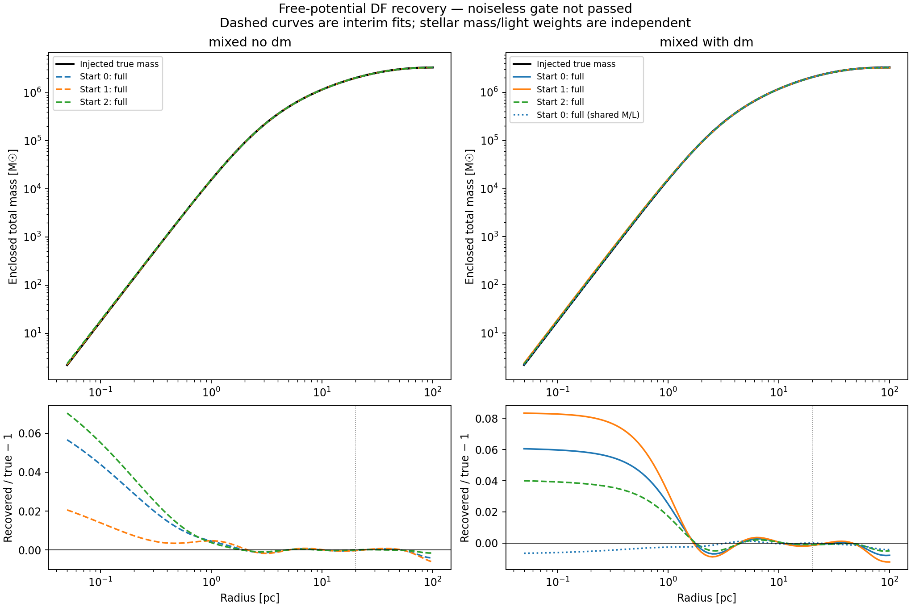
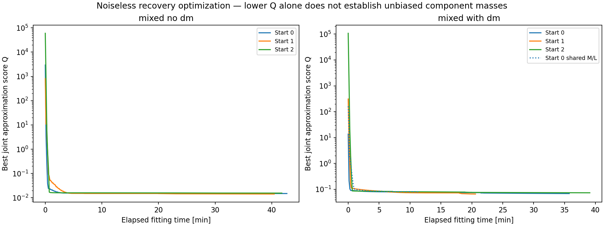
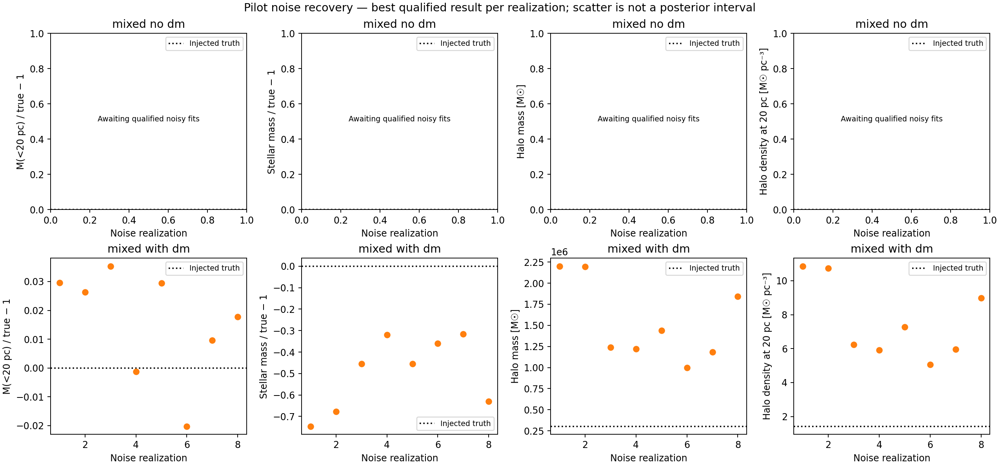

# Free-potential DF recovery: current status

Snapshot: 2026-09-22T21:17:54.948862+00:00. Batch status: **noiseless_gate_not_passed**.

The table reports the latest saved solution in each noiseless fit. Interim and unconverged solutions are not mass measurements.

| Mock | Start | Stage | Job | Q | Stellar mass | Halo mass | DM density at 20 pc | Qualified final fit |
|---|---:|---|---|---:|---:|---:|---:|---|
| mixed_no_dm | 0 | full | completed | 0.01489 | 2997086 | 318055 | 1.5994 | False |
| mixed_with_dm | 0 | full | completed | 0.06827 | 2709078 | 541508 | 2.6984 | True |
| mixed_no_dm | 1 | full | completed | 0.01422 | 2396990 | 907072 | 4.3645 | False |
| mixed_with_dm | 1 | full | completed | 0.06565 | 2325805 | 912241 | 4.6058 | True |
| mixed_no_dm | 2 | full | completed | 0.01551 | 3245729 | 77237 | 0.38141 | False |
| mixed_with_dm | 2 | full | completed | 0.07325 | 3003892 | 251623 | 1.2533 | False |
| mixed_with_dm shared M/L | 0 | full | completed | 0.07908 | 2600914 | 639449 | 3.1027 | True |

Masses are in solar masses; densities are in solar masses per cubic parsec. A qualified final fit has finished the full shape stage, met an optimizer termination criterion and passed numerical validation.

Jobs: 0 running, 0 queued, 23 completed, 0 failed.

Noisy fits and shared-M/L controls are added only after the noiseless accuracy gate passes. The planned eight noise realizations per mock assess recovery scatter; they are not a posterior-coverage certification.

[Methods and scope](DF_MASS_RECOVERY.md).

Batch: `/Users/vasilybelokurov/IoA Dropbox/Dr V.A. Belokurov/Code/oCen_dm/results/df/mass_recovery_20260922T151408Z`.

## Noisy recovery pilot

Only completed, numerically validated full-stage fits with optimizer termination enter this summary. The lower-Q qualified start is selected per realization. This small ensemble measures recovery scatter, not posterior coverage.

- mixed_no_dm: 0 qualified noise realizations.
- mixed_with_dm: 8 qualified noise realizations.

