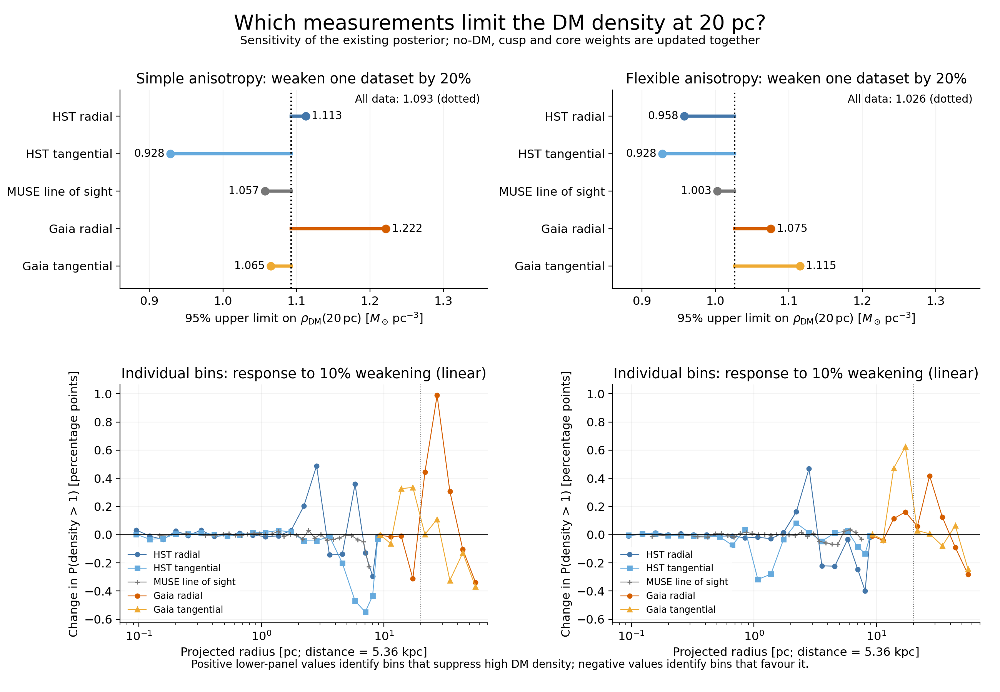
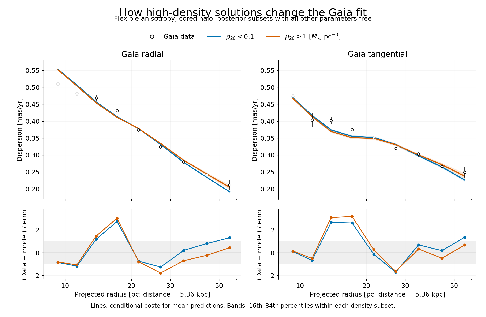

# Which measurements constrain the DM density at 20 pc?

In the present rung-2 fits, Gaia proper motions provide the strongest restraint
on the upper DM-density tail. The useful radii are mainly 14–35 pc, and the
balance between radial and tangential motions depends on the anisotropy model.
HST constrains the inner mass distribution and anisotropy; taken together, its
measurements also favour some of the solutions with more DM. MUSE has a smaller
effect on this particular upper limit.

This conclusion comes from changing the weight of each dataset in the fitted
posterior. It does not follow from ranking datasets by their total chi-square
or their number of measurements.

The subsequent [fixed-density refits](DM_DENSITY_PROFILE_LIMIT.md) test how far
the density can increase after all remaining parameters readjust. They find
little fit penalty at density 2, and show that the stellar-mass floor matters
at still higher densities. The posterior upper limit is therefore not a hard
data-only cutoff.



The upper panels weaken one dataset's log-likelihood by 20%, retaining the full
weight of the other data. In this fixed-error split-normal likelihood, that is
equivalent for posterior inference and model odds to increasing both error bars
by 1/sqrt(0.8), about 12%. The dotted line is the original 95% upper limit. A
move to the right means that weakening those measurements admits higher DM
densities; a move to the left means that the dataset was helping favour the
higher-density solutions.

| Data weakened by 20% | Simple beta(r): 95% upper limit | Flexible beta(r): 95% upper limit |
|---|---:|---:|
| None: original result | 1.093 | 1.026 |
| HST radial | 1.113 | 0.958 |
| HST tangential | 0.928 | 0.928 |
| MUSE line of sight | 1.057 | 1.003 |
| Gaia radial | 1.222 | 1.075 |
| Gaia tangential | 1.065 | 1.115 |
| All Gaia | 1.189 | 1.161 |
| All HST | 0.972 | 0.862 |

Density units are solar masses per cubic parsec. All upper limits include the
no-DM point probability and update the no-DM/cusp/core evidence weights. Model
priors remain 50%/25%/25%. Aggregate rows overlap the individual rows and should
not be added. Conditioning on DM being present gives the same main ordering:
weakening all Gaia changes the flexible-family upper limit from 1.127 to 1.240,
while weakening all HST changes it to 0.999.

The lower panels locate the individual bins responsible. They show the linear
response of P(rho_DM(20 pc) > 1 solar mass per cubic parsec) to a 10% reduction
in each bin's likelihood weight. Positive values identify bins that oppose the
upper-density tail; negative values identify bins that favour it. This signed
influence is not a fraction of all information, and the rankings need not hold
for a different density threshold or model family.

* With flexible anisotropy, the strongest Gaia contributions come from
  tangential bins 3 and 4 at projected radii 13.8 and 17.2 pc. The radial bin
  at 27.1 pc is also influential.
* With simple anisotropy, the strongest contribution is the radial bin at
  27.1 pc, followed by radial bins near 21.6 and 34.5 pc. The tangential bins
  near 13.8 and 17.2 pc still oppose the upper tail, but other tangential bins
  pull in the opposite direction.
* The HST radial bin near 2.8 pc is influential in both families, despite its
  much smaller radius. Its contribution is part of the joint constraint on
  the stellar and compact-remnant masses. Other HST bins oppose that tendency.
* The outermost bins near 56 pc do not set the present upper bound. They tend
  to favour the higher-density solutions within the sampled posterior.

Projected radii use a reference distance of 5.36 kpc for display; each model
prediction retains its own sampled distance. HST covers approximately
0.09–8.9 pc, MUSE 0.15–7.5 pc, and Gaia 9.3–55.8 pc. These are projected
kinematic constraints on the gravitational potential. Converting them into a
local DM density also uses the assumed halo profile and the decomposition of
stellar, remnant, black-hole and halo mass.

## What high-density solutions do to the fit



This figure uses the flexible cored-halo posterior, split into local densities
below 0.1 and above 1 solar mass per cubic parsec. Lines are conditional mean
predictions; bands show the within-subset 16th–84th percentiles. All other
parameters vary with density, so these are not predictions from adding DM to
an otherwise fixed model.

| Posterior subset | Median stellar mass | Median compact-remnant mass | Median halo scale radius |
|---|---:|---:|---:|
| rho_DM(20 pc) < 0.1 | 2.76 million solar masses | 0.46 million solar masses | 141 pc |
| rho_DM(20 pc) > 1 | 1.39 million solar masses | 1.65 million solar masses | 65.5 pc |

High-density solutions shift mass out of the light-tracing stellar component
and into compact remnants and DM. Their tangential predictions at 14–17 pc
fall farther below the Gaia measurements, while the radial prediction near
27 pc rises farther above the data. At the largest radii the extra halo mass
can improve the fit. The density bound therefore comes from the shape and
component ratios of the profiles, together with the inner mass constraints.
It cannot be reduced to requiring the model dispersion to stay below every
outer point.

The stellar-mass prior has a lower bound
of one million solar masses. The high-density flexible-core subset moves
towards that bound. The later [controlled check](DM_DENSITY_PROFILE_LIMIT.md)
confirms that lowering the floor reduces the best-fit penalty at very high
density. This reweighting calculation measures data sensitivity within the
archived priors and does not establish a prior-independent upper limit.
Gaia tangential predictions also depend on the adopted published rotation
correction. These results identify the 14–17-pc tangential bins and that
correction as useful targets for a subsequent data/systematics audit.

## Method and reliability

All six saved maximum likelihoods were replayed. The common observation
fingerprint was checked, and the exact split-normal log-likelihood was
evaluated for all 27,461 unique posterior parameter vectors. Duplicate draws
retain their original counts, so the original posterior is reproduced.
All sampled parameters remain free through reweighting.

For a removed fraction f of dataset g, the importance ratio is
exp(-f log L_g). Its posterior expectation updates the model evidence by
Z_new/Z_original, so both within-model distributions and model probabilities
change. This is intentional likelihood tempering; it does not apply the
original likelihood a second time. The individual-bin derivative is
-Cov[1(rho>1), log L_i] in the model-averaged posterior.

All 10% and 20% weakening experiments passed the overlap screen. For 20%
weakening, every individual model retained at least 1,226 effective unique
draws. Random split-half upper limits differed by at most 3.5%, and DM model
probabilities differed by at most 1.7 percentage points. The screen requires
at least 200 effective unique draws per model, maximum individual weight at
most 2%, split-half upper-limit agreement within 15%, and model-probability
agreement within 10 percentage points. These are diagnostics, not a proof
that unsampled posterior regions are irrelevant.

Full dataset removal failed this screen for every tested group. Some
comparisons collapsed to one or two effective draws. Their raw estimates are
retained with `overlap_screen_passed: false` in the JSON for transparency and
must not be quoted as leave-one-dataset-out results. Independent refits are
needed to measure the full effect of removing Gaia or HST. The reliable result
here is the local sensitivity and the 10–20% weakening response.

Three targeted tests verify the calculation against an analytic Gaussian
refit, check evidence changes and likelihood-normalisation invariance, and
check the individual-bin covariance derivative against finite reweighting.
The cached prediction files preserve source/input hashes and the original fit
directories are unchanged.

[Numerical results, overlap checks and plot provenance](../results/plot_data/dm_density_data_constraints.json)
and [individual-bin influences](../results/plot_data/dm_density_data_constraints.ecsv)
are stored outside `plots/`. Reproduce both figures and the calculations with:

```sh
PYTHONPATH=src python bin/analyse_dm_density_constraints.py
```
