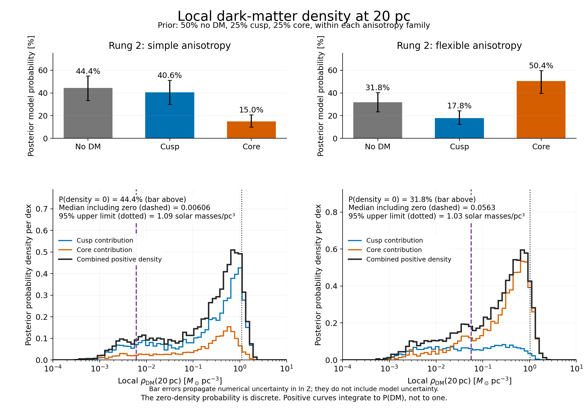

# Probability distribution of the local DM density at 20 pc

The completed rung-2 fits give a posterior distribution for the local dark-matter
density at 20 pc. Bayesian model averaging includes the no-DM alternative as a
discrete probability at zero. With the model priors below, the flexible-anisotropy
fits give 31.8% probability to no DM and a 95% upper density limit of
1.026 solar masses per cubic parsec. This is a modest preference for DM within
the specified model set, with a DM/no-DM Bayes factor of 2.15.



The [data-sensitivity analysis](DM_DENSITY_DATA_CONSTRAINTS.md) identifies which
datasets and radial bins suppress or favour the upper-density tail.
The [fixed-density refits](DM_DENSITY_PROFILE_LIMIT.md) show that the 95% limit
is not a hard likelihood exclusion: density 2 still permits a nearly equally
good fit, while density 5 incurs a substantial penalty under the original bounds.

For each model, transform every saved posterior draw into rho_DM(20 pc), using
the joint draw of M_DM(<100 pc) and scale radius. Other parameters have already
been marginalised by sampling. The calculation uses the local point density;
it is distinct from M_DM(<20 pc), the mean enclosed density, and the finite-shell
density estimator used in the N-body diagnostics.

The posterior samples already incorporate the likelihood and parameter priors.
Weighting them by exp(ln L) again would count the likelihood twice. A model's
maximum ln L and ln Z alone cannot reconstruct its density posterior: the saved
samples provide its shape. Across models, the weights are

```text
w_j = prior(M_j) exp(ln Z_j) / sum_k [prior(M_k) exp(ln Z_k)]
p(rho | data) = sum_j w_j p(rho | data, M_j).
```

The no-DM contribution is w_noDM times a delta function at rho = 0. It is shown
as a separate bar because zero cannot appear on a logarithmic density axis.
The positive histogram is a probability density per dex; its integrated area
is P(DM), not one. Purple dashed lines mark the medians of the full distributions;
black dotted lines mark their 95% upper limits. Both include the zero-density
probability.

The default prior gives equal odds to DM versus no DM: 50% no DM, 25% cusp,
25% core. Within DM models, the archived parameter priors remain unchanged:
M_DM(<100 pc) is log-uniform from 10^3 to 3 x 10^7 solar masses, and scale radius
is log-uniform from 3 to 1000 pc. The fitting taper radius is fixed at 1000 pc.

| Anisotropy family | P(no DM) | P(cusp) | P(core) | Median density | 16th–84th percentiles | 95% upper limit |
|---|---:|---:|---:|---:|---:|---:|
| Simple beta(r) | 44.4% | 40.6% | 15.0% | 0.00606 | 0–0.661 | 1.093 |
| Flexible beta(r) | 31.8% | 17.8% | 50.4% | 0.0563 | 0–0.653 | 1.026 |

All density columns are in solar masses per cubic parsec. If we condition on
the presence of DM and combine only cusp and core, the median densities become
0.319 (simple) and 0.272 (flexible); their 95% upper limits become 1.271 and
1.127. These are different questions from the full mixture including no DM.

Assigning equal prior probabilities to the two anisotropy families, then
averaging all six rung-2 models, gives a simple-family posterior weight of
6.01 x 10^-14. The joint density distribution therefore matches the flexible
result to the precision reported here. The two families differ in both their
radial flexibility and their central-anisotropy prior, so this comparison
evaluates those complete model specifications. Rungs 0 and 1 remain diagnostic
baselines and are not included in this six-model average.

Model priors matter. Equal prior probabilities for each of no DM, cusp and core
would assign DM twice the prior probability of no DM; it would reduce P(no DM)
to 28.5% (simple) or 18.9% (flexible). Neither choice is fixed by the likelihood.
The reported probabilities are conditional on the tested models and all their
parameter priors, rather than probabilities covering every possible cluster model.

The figure's error bars propagate the reported numerical ln Z errors through
the weights, treating the six errors as independent Gaussians. They give
P(no DM) ranges of 33.4–54.9% (simple) and 23.5–40.4% (flexible) at the
16th–84th percentiles. They hold each within-model density posterior fixed and
do not describe uncertainty from missing model physics or alternative priors.

The compact-remnant simulations start at local densities of 1.257 (cusp) and
1.788 (core), both with M_DM(<20 pc) = 10^5 solar masses. Under the joint
kinematic mixture, 1.99% of the density probability lies above the first value
and 0.187% above the second. These compare present-day fitted densities with
simulation starting densities; the evolved simulation profile is what should
ultimately be compared with the data. The simulation and fitting outer tapers
also differ.

All six saved maximum likelihoods replay, and their 89-point observation
fingerprints match. The density conversion is checked against the production
halo implementation at nine posterior draws per DM model. Three targeted tests
check an analytic NFW limit, the discrete zero component and sample-count
invariance, and evidence weighting with different priors and large log offsets.

[Posterior density samples](../results/plot_data/dm_density_20pc_posterior.ecsv)
and [model weights, quantiles, priors and checksums](../results/plot_data/dm_density_20pc_posterior.json)
are stored outside `plots/`. Reproduce the calculation with:

```sh
PYTHONPATH=src python bin/plot_dm_density_posterior.py
```
