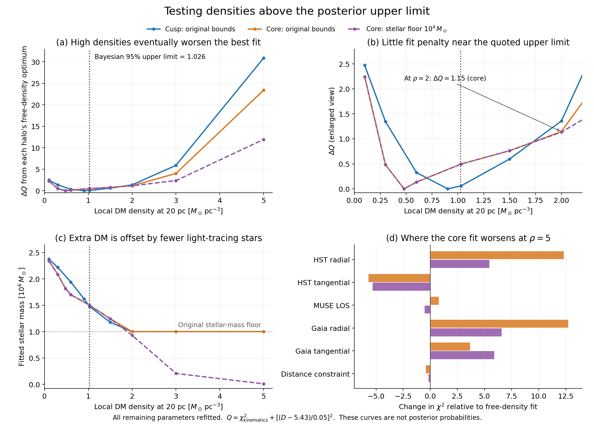
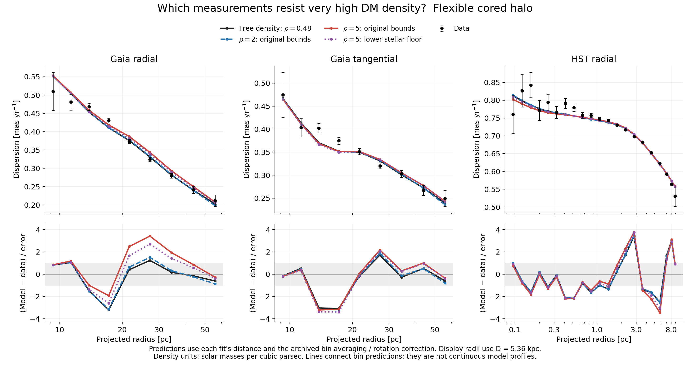

# What rules out densities above the quoted DM upper limit?

The quoted 95% upper limit, rho_DM(20 pc) = 1.026 solar masses per cubic
parsec, is not a hard exclusion. Refitting the remaining parameters at fixed
density gives a counterexample: twice that density can fit almost as well as
the best free-density model. Much larger densities do worsen the fit, but the
penalty depends on the allowed stellar mass as well as the measurements.

Two [posterior checks](DM_DENSITY_POSTERIOR_CHECKS.md) were subsequently launched:
an independent free-density cored-halo run and a conditional run at density 2,
both with 800 live points and longer sampler walks. Their results are pending.

These are new constrained optimisations of the flexible rung-2 cusp and core
models, using the same 89 kinematic measurements, errors, rotation corrections,
bin averaging and model definitions as the archived fits. The original nested
sampling runs and posterior distributions are unchanged.



**Figure 1.** All remaining parameters are refitted at each density. The upper
panels show the increase in the fitting objective Q; panel (b) enlarges the
region around the earlier Bayesian limit. Panel (c) shows the compensating
change in stellar mass. Panel (d) separates the signed contributions to the
penalty at density 5 for the core model. Purple curves lower the stellar-mass
floor from one million to ten thousand solar masses as a sensitivity test.
Points are calculated fits; connecting lines guide the eye.

The objective is

```text
Q = chi2_kinematics + [(D - 5.43 kpc) / (0.05 kpc)]^2.
```

The distance term retains the archived Gaussian distance constraint. All other
priors impose their allowed ranges only; their probability densities do not
enter Q. Each column below measures the increase relative to its own
free-density optimum. These increases are not calibrated confidence levels.

| Fixed local DM density at 20 pc | Core: original bounds | Cusp: original bounds | Core: lower stellar floor |
|---|---:|---:|---:|
| 1.03 | 0.50 | 0.06 | 0.50 |
| 2.00 | 1.15 | 1.36 | 1.13 |
| 3.00 | 4.01 | 5.90 | 2.36 |
| 5.00 | 23.39 | 30.86 | 11.92 |

Density units throughout are solar masses per cubic parsec. The free-density
optima are rho = 0.4793, Q = 187.798 for the core, and rho = 0.9004,
Q = 188.286 for the cusp. The core's kinematic chi-square is 185.789; the
remaining 2.009 comes from distance. The lower-floor core has the same free
optimum. These optima improve slightly on the best points encountered by the
posterior sampler, as expected from a separate optimisation.

## Which measurements penalise very high density?



**Figure 2.** The flexible core model at its free-density optimum, at fixed
densities 2 and 5 with the original bounds, and at density 5 with the lower
stellar floor. The lower panels show signed residuals in measurement-error
units. Predictions retain each fitted distance; displayed projected radii use
5.36 kpc. The radial coordinates of the measurements are projected distances,
whereas rho_DM(20 pc) is the local three-dimensional density.

For the core at density 5 with the original bounds:

* **Gaia radial motions at 22–35 pc become too high.** The residuals at
  21.6, 27.1 and 34.5 pc change from +0.40, +1.24 and +0.17 to
  +2.48, +3.42 and +1.92 measurement errors. Across the nine radial bins,
  chi-square rises by 12.73.
* **HST radial motions resist the compensating inner-mass rearrangement.**
  Their chi-square rises by 12.31. At 5.8 pc the prediction falls from
  2.52 errors below the measurement to 3.46 errors below it. Thus the
  penalty is not simply excessive dispersion everywhere.
* **Gaia tangential motions add a smaller penalty of 3.67.** The existing
  underprediction at 14–17 pc persists. These bins strongly influence the
  posterior tail near density 1, as shown in the
  [data-weighting experiment](DM_DENSITY_DATA_CONSTRAINTS.md), but the largest
  additional deterioration by density 5 is in the radial measurements.

HST tangential chi-square improves by 5.70, MUSE worsens by 0.79, and the
distance penalty improves by 0.41. The signed sum is Delta Q = 23.39.
These changes describe the joint refit's compromise; they are not independent
measurements of each dataset's information content. Existing residuals in the
free-density model also remain, so the comparison does not certify its
absolute goodness of fit.

## How does extra DM remain possible?

The kinematics constrain the total gravitational potential. The model can
exchange mass between the halo, light-tracing stars and compact remnants.
For the core:

| Fixed density | Stellar mass [million solar masses] | Remnant mass [million solar masses] | Halo scale radius [pc] |
|---|---:|---:|---:|
| 1.03 | 1.499 | 1.561 | 49.35 |
| 2.00 | 1.000 | 1.944 | 13.11 |
| 5.00 | 1.000 | 1.587 | 4.96 |

Near density 2 the stellar mass reaches its prior floor. Beyond that, the
original model cannot reduce this component further. Lowering the floor to
10,000 solar masses reduces Delta Q at density 3 from 4.01 to 2.36, and at
density 5 from 23.39 to 11.92. At density 3 the relaxed fit uses only 206,000
solar masses in light-tracing stars and 2.58 million in remnants. At density 5
it reaches even the relaxed floor. This is a diagnostic change of prior
support, not an adopted mass model or a newly calculated posterior limit.

Other bounds also matter: every optimum reaches beta_0 = -0.5; the
free-density halo scale radii reach their 1,000-pc upper bound; and both
original models at density 5 reach beta_inf = -1. The physical interpretation
therefore remains conditional on the chosen halo and anisotropy families,
mass priors and treatment of rotation. Global distribution-function positivity
has not been established by these Jeans refits.

## Why can the Bayesian upper limit still be near 1?

The [earlier posterior](DM_DENSITY_POSTERIOR.md) integrates over all nuisance
parameters with their prior weights and averages the no-DM, cusp and core
hypotheses. Its 1.026 limit includes the probability at exactly zero; conditional
on DM being present, the corresponding 95% limit is 1.127. Neither operation
selects only the best possible fit at each density.

A small region of parameter space can contain a good fit while contributing
little integrated posterior probability. The present refits establish that
the likelihood does not impose a sharp cutoff at 1.026. They do not partition
the posterior suppression into prior weighting and nuisance-parameter volume,
recompute model evidences, or test the sampler's coverage of narrow regions.
The original 95% credible limit should retain its explicit model and prior
qualification. It should not be described as the largest density compatible
with the data.

## Numerical checks and reproduction

The scan fixes densities 0.1, 0.3, 0.6, 1.03, 1.5, 2, 3 and 5. It eliminates
M_DM(<100 pc) analytically in favour of the requested density and halo scale
radius, then optimises the other 11 parameters with bounded least squares.
Each target uses three starts followed by a smaller finite-difference step.
The original-core and cusp starts agree to better than 2e-7 in Q. The
relaxed-core starts at density 5 initially span 0.18 in Q; four additional
starts recover the selected best value to 3e-8. These checks support the
reported solutions without proving a global minimum.

All 27 stored solutions replay their predictions and per-dataset chi-squares
exactly. Their residual objective matches the production split-normal
log-likelihood, apart from its parameter-independent normalisation and the
explicit distance term. The numerical distance bounds at eight prior standard
deviations are never active. Fixed-density conversion agrees with the
production halo density; original input and model-source hashes are verified.
Four new targeted tests cover analytic NFW normalisation, both production halo
profiles across the scale-radius range, parameter elimination, the exact
likelihood objective, and rejection outside halo-mass support. All ten tests
across this and the two preceding density analyses pass.

The diagnostic runs live in
`results/diagnostics/dm_density_profile_20260922/`. The scan script refuses to
overwrite them. The separately stored `high_density_multistart_check.json`
records the additional four starts at density 5, including three perturbations
of the optimum with random seed 731 and encoded-parameter scatter of 10% of
each allowed range. Plotting replays the saved results, checks the additional
fits, and preserves all inputs:

```sh
PYTHONPATH=src python bin/plot_dm_density_profile.py
python -m pytest -q tests/test_dm_density_profile.py tests/test_dm_density_posterior.py tests/test_dm_density_constraints.py
```

[Fit parameters, checks and provenance](../results/plot_data/dm_density_profile_limit.json)
and [all five datasets' bin predictions and residuals](../results/plot_data/dm_density_profile_residuals.ecsv)
are stored outside `plots/`.
