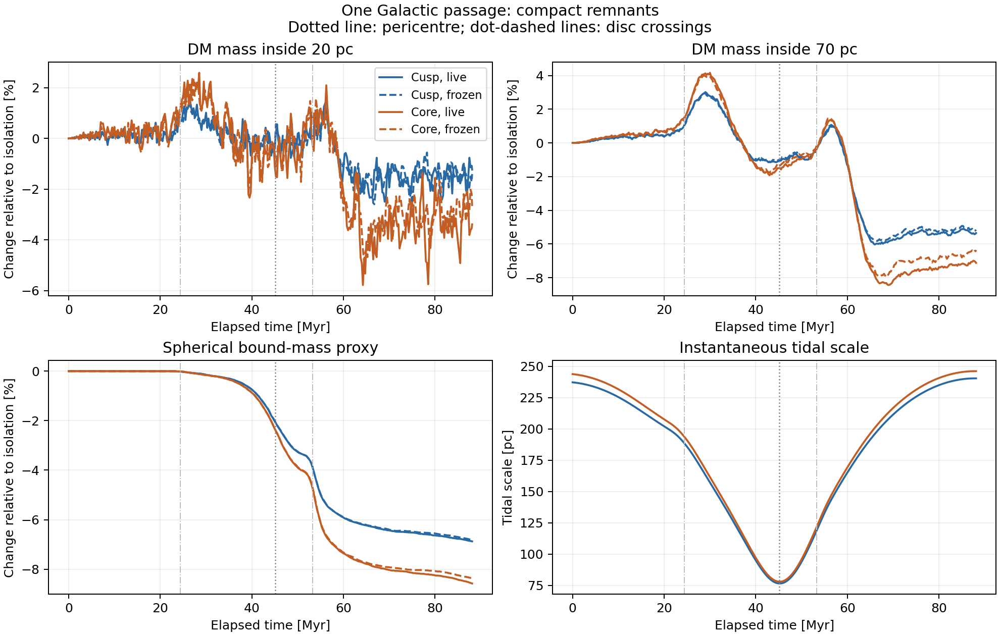
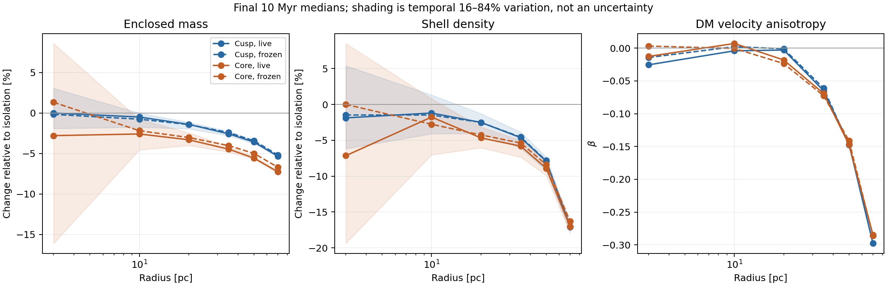
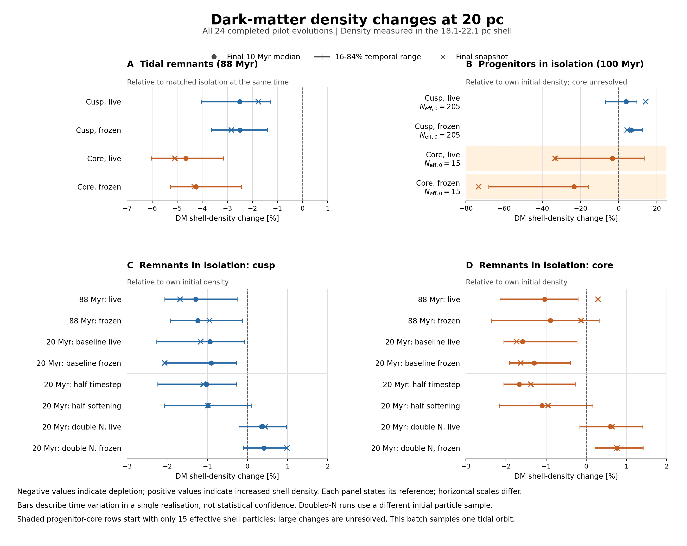
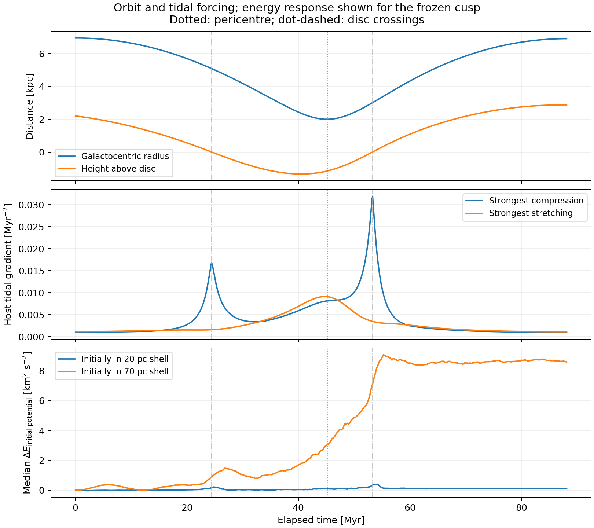
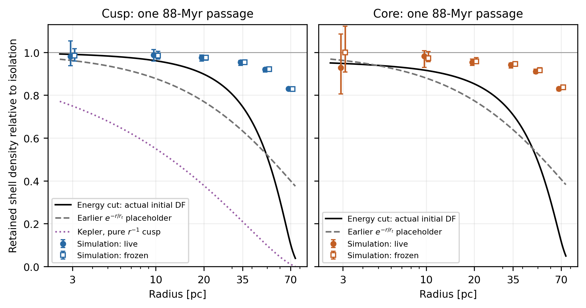
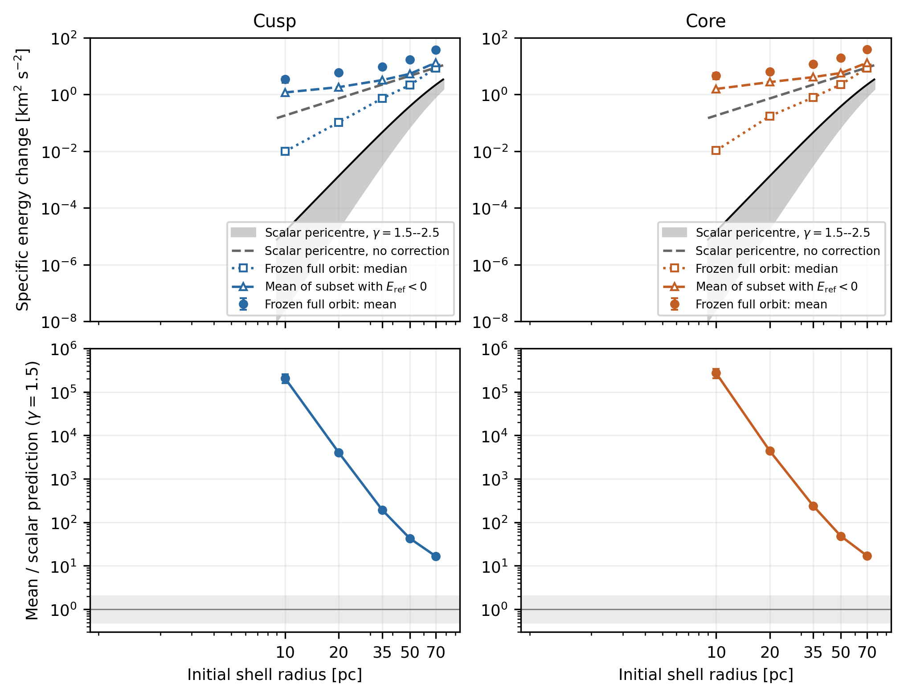
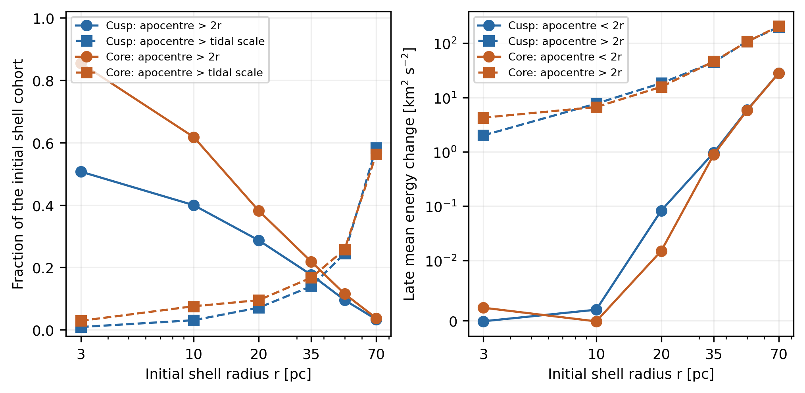
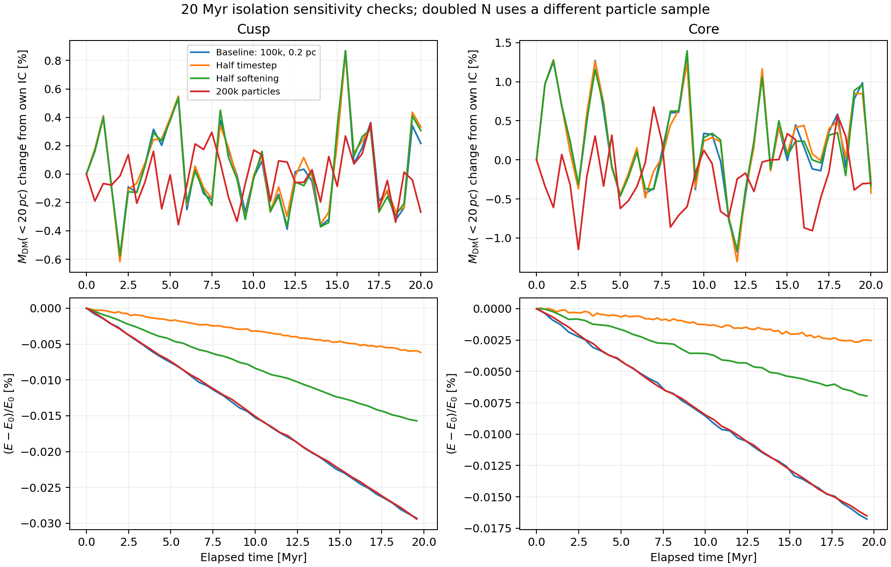
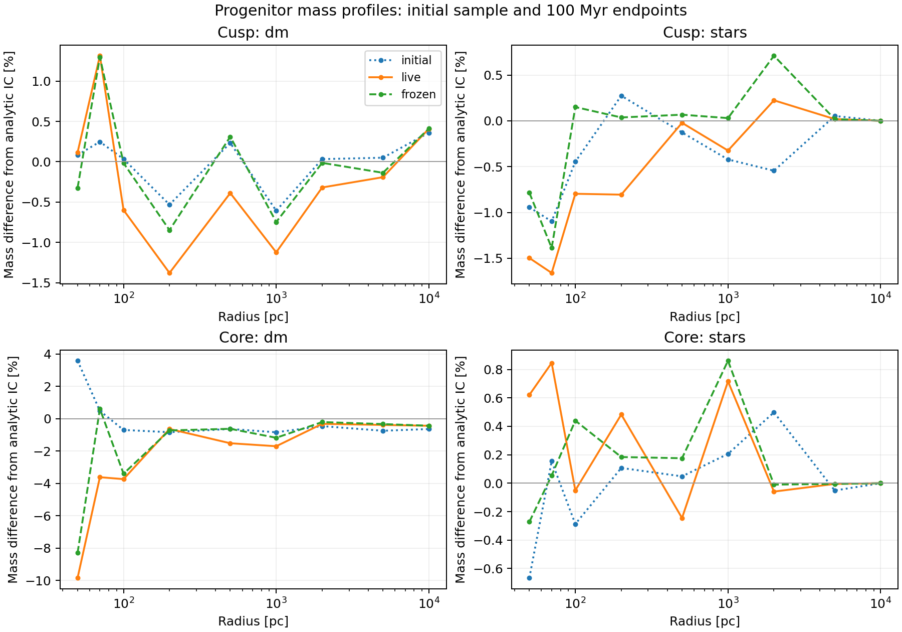
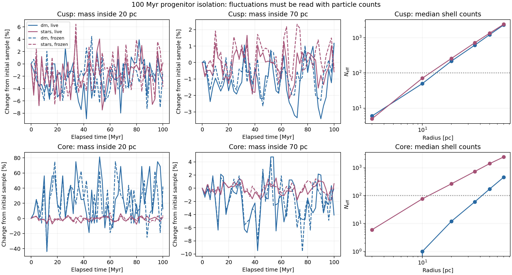

# Dynamical pilot batch: 21 September 2026

The detailed write-up is available as a [PDF](dynamical_batch.pdf),
[LaTeX source](dynamical_batch.tex), and a
[portable LaTeX archive with figures](../output/source/dynamical_batch_latex.zip).
The [20-pc density summary](../plots/density_changes_20pc.png) collects all 24 completed
evolutions in one figure. It is also included in the write-up as Figure 7,
Section 8, on page 11.

The batch establishes a useful first result for each programme. The compact cusp
and core both retain most of their central dark matter through one Galactic
passage; depletion grows with radius, and the core responds more strongly under
the adopted matching convention. The extended progenitors remain close to their
initial mass profiles on well-sampled scales in isolation. Their cored model needs
better central sampling before its inner DM evolution can be measured.

This analysis covers **24 completed evolutions from 14 preparations**, including
the successful replacement for the softening run that previously failed. The
original failed runs remain preserved and are excluded. These are the intended
pilot experiments: they establish behaviour and guide the next controlled runs.

**Compact remnants: one passage.** Each starts with a target DM mass of
100,000 Msun inside 20 pc, scale radius 20 pc, density taper 100 pc and isotropic
DM velocities. The nucleus is a rigid Plummer model with mass 3.55 million Msun
and scale 5.4 pc. Matching the inner DM mass gives different total DM masses:
432,466 Msun for the cusp and 771,985 Msun for the core. The comparison therefore
tests these two specified distributions; it does not isolate central slope at
fixed total halo mass.

The common orbit in the static McMillan17 host runs from apocentre to apocentre
over 88.10216 Myr. Its pericentre is 1.99817 kpc at 45.11369 Myr. Within each
profile, the tidal and isolation runs have identical initial local phase space,
particle IDs and masses. Both profiles use identical host assets and orbit files.

The table reports `100 × (tidal / isolation − 1)` at the common final time. Thus
the small evolution in isolation has already been accounted for.

| Diagnostic | Cusp, live | Cusp, frozen | Core, live | Core, frozen |
|---|---:|---:|---:|---:|
| DM mass inside 20 pc | −1.23% | −1.40% | −3.39% | −2.66% |
| DM mass inside 70 pc | −5.35% | −5.23% | −7.12% | −6.35% |
| Spherical bound DM mass proxy | −6.88% | −6.82% | −8.58% | −8.36% |

The earlier values of −1.21% and −3.42% at 20 pc were relative to the initial
particle samples. The small difference from this table comes from using the
completed isolation controls. Their own endpoint changes are +0.0216% and
−0.0308%, respectively.



The result persists over the final 10 Myr, rather than depending on one snapshot.
The median 20-pc mass deficits relative to isolation are **1.41% for the live cusp
and 3.31% for the live core**. Their temporal 16th–84th percentile ranges are
1.15–1.96% and 2.43–4.02%. These describe correlated variation within one run;
they are not statistical confidence intervals or a substitute for other seeds.
The corresponding frozen medians are 1.43% and 3.03%.

The radial response is stronger outside the centre. Over the final 10 Myr, the
live density in the 20-pc shell is lower than isolation by 2.50% and 4.66%, whereas
the 70-pc shell is depleted by about 17% in both profiles. The outer velocity
distribution becomes tangential: median beta at 70 pc is −0.298 for the cusp and
−0.285 for the core, compared with values near zero in isolation. At 20 pc it
remains close to isotropic. The 70-pc shells retain thousands of effective
particles. The 3-pc core shell has as few as 59, so its much noisier response
does not establish a central density change.



**Density changes at 20 pc across the batch.** The summary below uses the
18.1-22.1 pc shell. Panel A compares tidal remnants with matched isolation at
the same time; panels B-D compare isolation runs with their own initial shell
density. Points give final-10-Myr medians, bars give temporal 16th-84th
percentiles, and crosses give final snapshots. The median tidal changes are
−2.50% for both cusp runs, −4.66% for the live core, and −4.25% for the frozen
core. Some isolation runs show increases. The progenitor core starts with only
15 effective shell particles, so its large excursions remain unresolved.
These are shell-density measurements; the enclosed-mass changes above measure
a different quantity. The figure covers the completed batch, including one
tidal orbit, rather than the full range of possible experiments.



Reproduce this figure with `python bin/plot_density_changes_20pc.py`. Its
[numerical values and input checksums](../results/plot_data/density_changes_20pc.json) accompany the
PDF in `docs/`.

The frozen potential reproduces most of the first-passage response. This shows
that evolution of the DM self-potential adds relatively little in these compact,
nucleus-dominated models over this interval. It does not establish that a frozen
potential will remain adequate after many passages or for the massive progenitors.
The bound-mass diagnostic is a spherical energy proxy about the prescribed
nucleus; its decline is not an exact escape fraction. No particles were removed.

**Timing and tidal forcing.** The orbit crosses the disc twice. The crossing
times below were found from zeros of the saved Cartesian track's z coordinate.

| Event | Elapsed time | Radius | Vertical speed |
|---|---:|---:|---:|
| First disc crossing | 24.42066 Myr | 5.09361 kpc | −126.98 km/s |
| Pericentre | 45.11369 Myr | 1.99817 kpc | — |
| Second disc crossing | 53.27006 Myr | 3.00873 kpc | +175.40 km/s |

The crossing radii are cylindrical; the pericentre radius is spherical. The
strongest compressive eigenvalue of the host force gradient has magnitude about
0.0169 Myr^-2 at the first crossing and 0.0323 Myr^-2 at the second. The
instantaneous tidal-radius diagnostic reaches its minimum near pericentre,
about 76.5 pc for the cusp and 77.9 pc for the core. These diagnostics describe
different aspects of the forcing: the compressive disc pulse is not captured by
the minimum tidal radius alone.



The sharp outer depletion follows the second crossing. In the frozen cusp, the
median change in energy measured in the initial satellite potential ends near
8.60 (km/s)^2 for particles initially in the 70-pc shell, compared with
0.104 (km/s)^2 for those initially in the 20-pc shell. The association between the
disc pulse, outer heating and subsequent depletion supports disc shocking as
part of the response. The batch contains no control that separates the disc
contribution from the preceding pericentre passage, so it cannot assign their
individual contributions.

**Comparison with the analytical prescriptions.** Section 6 of the
[LaTeX report](dynamical_batch.pdf) now compares the same orbit and initial
potentials with the energy-cut and scalar pericentre estimates. The broad
trend agrees: the outer remnant responds more strongly. The numerical
amplitudes do not agree with these simple prescriptions after one passage.

At 20 pc the actual-DF energy cut predicts shell-density losses of 10.18%
(cusp) and 14.71% (core), compared with live losses of 2.50% and 4.66%.
The energy cut assumes instantaneous removal at the minimum tidal scale;
it is neither a finite-time stripping calculation nor a demonstrated
long-term equilibrium. The pure Kepler-cusp formula and exponential
placeholder depart further from the measured profiles.



The frozen full-orbit mean energy increments of the initial 20-pc cohorts
are 5.88 and 6.46 (km/s)^2, against scalar pericentre predictions of 0.00145
and 0.00147 (km/s)^2 with the adopted adiabatic correction. The medians are
only 0.1045 and 0.1728 (km/s)^2. These are different statistics: eccentric
internal orbits and escaping particles dominate the means, while the
scalar formula omits the disc crossings and continued host work. About
1.1% of each initial 20-pc cohort has positive reference energy at the end,
contributing 69% and 58% of the net increments. This does not measure heat
retained by a closed bound subsystem or isolate a pericentre shock.



Of particles initially near 20 pc, 28.7% and 38.2% have initial apocentres
beyond 40 pc. They supply 99–100% of the late mean energy increment. Thus a
local frequency at 20 pc is inadequate for the entire cohort. Mean energy
increments are still only 1.30% and 1.50% of the cohorts' initial mean
binding energies. The mismatch in the heating prescription does not imply
that the inner density has been destroyed, nor does it establish an
adiabatic exponent or a lifetime density-loss rate.



`bin/compare_dynamical_analytics.py` reproduces these comparisons without
altering simulations. `results/plot_data/dynamical_analytics.json` records values,
definitions, quadrature checks and hashes. The analysis reproduces the
previously audited energy medians from the saved frozen snapshots.

**Numerical sensitivity.** The shorter isolation controls cover 20.00762 Myr.
They vary one setting at a time around the 100,000-particle, 0.2-pc-softening
baseline. Halving the timestep means halving the maximum and minimum block steps.

| Control | Cusp: endpoint M(<20 pc) difference from baseline | Core: same |
|---|---:|---:|
| Half timestep | +0.116% | −0.062% |
| Half softening | +0.091% | +0.031% |
| Double particle number | −0.642% | −0.046% |

The doubled-N case has a different particle sample. Its own live/frozen endpoint
differences are +0.011% and −0.155%, so its difference from the original sample
should not be attributed entirely to numerical bias. The original and doubled-N
runs all keep their spherical bound-mass proxies constant in isolation.



Maximum logged absolute fractional energy changes in 20 Myr are 0.0293% and
0.0168% for the baseline cusp/core, falling to 0.00617% and 0.00266% with half
timesteps. The longer 88-Myr baseline isolation runs reach 0.135% and 0.0728%.
The small secular drift favours the finer timestep for the next longer runs;
stable M(<20 pc) alone does not validate arbitrarily long integrations. Energy
changes from runs with a prescribed moving nucleus are not used as conservation
errors, because that external potential can do work.

The repaired 0.1-pc-softening cusp run reaches the full endpoint and enters the
table above. Its repair evaluates the same P1 force coefficients without an
overflowing intermediate; it changes no physical parameter. The original failed
attempts and instrumentation run are retained separately. The other controls
used the original kernel. A dedicated force comparison and pre-failure trajectory
comparison support equivalence of the repair, but the repaired kernel has not
been used to repeat the full tidal passage in this batch.

These checks support the present pilot interpretation. They do **not** yet
establish convergence of the tidal response: the changes in timestep, softening
and particle number were tested in isolation for 20 Myr, whereas the tidal
experiment spans 88 Myr. Only one seed was used.

**Extended progenitors: isolation.** Both cusp and core have 10^9 Msun of DM and
10^8 Msun in the extended stellar component, with the same rigid nucleus. They
use 200,000 DM and 100,000 stellar particles with pericentre-based mass refinement.
Their initial DM beta is −0.3 and their stellar beta is zero. All four live/frozen
evolutions completed 100.00826 Myr.

The DM and stellar bound-mass proxies remain constant. Maximum logged live
energy drift is 0.00244% for the cusp and 0.00114% for the core. At every saved
epoch, no particles heavier than ten times their component's minimum particle
mass contribute inside the 100-pc protection radius. This is the defined heavy
particle diagnostic; it does not by itself exclude all effects of particle
mass differences or finite-N relaxation.

The original diagnostic apertures ended at 70 pc. This analysis independently
reads the final snapshots and extends the mass profiles to 10 kpc. At the sampled
radii from 100 pc through 10 kpc, live and frozen endpoint enclosed masses differ
by less than 1% for both components in both models. At 1 kpc the DM differences
are −0.38% and −0.53%; stellar differences are −0.35% and −0.14%. This supports
using the models for the next experiments on disruption of their extended bodies.



Central resolution is much less uniform:

| Initial quantity | Cusped progenitor | Cored progenitor |
|---|---:|---:|
| Analytic DM mass inside 20 pc | 149,950 Msun | 2,772 Msun |
| Sampled DM mass inside 20 pc | 152,315 Msun | 2,142 Msun |
| Effective DM particles inside 20 pc | 539 | 16 |
| Effective DM particles in the 20-pc shell | 205 | 15 |
| Effective stellar particles inside 20 pc | 669 | 692 |

The core's live M_DM(<20 pc) ends 12.5% above its initial value; its frozen
control ends 43.75% above. These correspond to only 18 and 23 particles,
respectively, versus 16 initially. Both show large fluctuations, with a median
aperture count of 20. The initial sample was already below its analytic target.
Neither percentage is evidence for physical central mass growth. Its inner
density and anisotropy estimates are also poorly sampled. The cusp has several
hundred central particles, adequate to identify gross changes but still noisy
for small shell-density differences.



**Next experiments.** The two programmes can advance independently:

1. For compact remnants, extend the timestep and particle-number comparisons to
   the complete tidal passage, with the corresponding isolation and frozen
   controls. Use the repaired kernel and assess the 20- and 70-pc response before
   expanding to repeated passages. A second particle seed would measure variation
   that the present temporal bands cannot. The disc-crossing signature also
   motivates a later controlled comparison of host components.
2. For full progenitors, the present sampling supports a first experiment on
   disruption of the extended body along a specified orbit. Before using that
   experiment to infer a central DM remnant, improve central sampling, especially
   for the core, and validate it in isolation. Simply doubling its present count
   would leave only a few tens of DM particles inside 20 pc; the sampling design
   needs attention. Add diagnostics over 0.1–10 kpc at all output times to follow
   the stripping of the extended stellar body and halo.

All results remain conditional on the rigid nucleus, prescribed orbit and adopted
initial models. The remnant ICs are isolated spherical equilibria inserted at
apocentre, without prior tidal relaxation. The progenitor batch contains no tidal
evolution yet. No new evolution was launched during this analysis.

**Reproduction and audit.** The analysis script is
[`bin/analyse_dynamical_batch.py`](../bin/analyse_dynamical_batch.py). Run it from
the project root in the existing environment, with a fresh output directory:

```bash
PYTHONDONTWRITEBYTECODE=1 PYTHONPATH=src OMP_NUM_THREADS=1 OPENBLAS_NUM_THREADS=1 \
  MPLCONFIGDIR=/private/tmp/ocen-nbody-mpl \
  ~/Work/venvs/.venv/bin/python bin/analyse_dynamical_batch.py \
  --output results/dynamics/batch_analysis_repeat
```

The retained analysis is in
[`results/dynamics/batch_analysis_20260921_v2`](../results/dynamics/batch_analysis_20260921_v2).
It contains six figures in PNG/PDF, the expanded endpoint profiles, orbit/forcing
samples, a machine-readable summary, a copy of the analysis source and artifact
checksums. The first analysis directory remains as an earlier version before the
disc-crossing comparison was added.

Checks verified the prepared-input hashes, all 24 diagnostic checksums, evolution
manifest links, durations, monotonic times, constant component masses, nested
apertures and matched initial particles. Final snapshots from 12 evolutions were
read independently; their particle IDs, masses and epochs passed checks, and their
remeasured apertures agree with the saved diagnostics. These snapshot files are
also hashed in the analysis record. Original simulation products were not edited.
