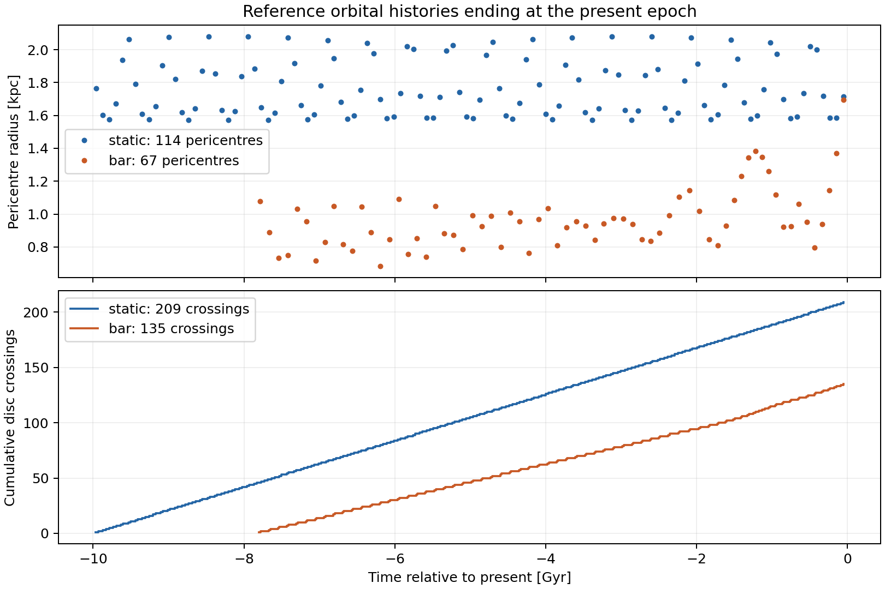
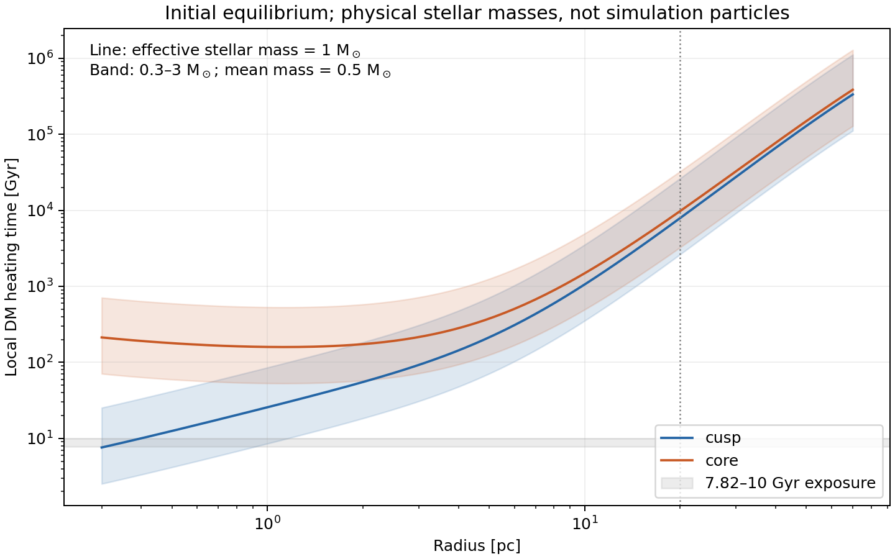
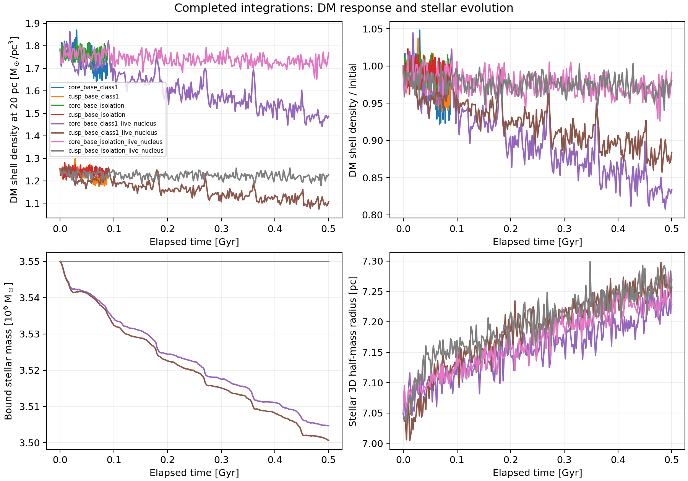

# Lifetime evolution: implementation and running batch

Updated 2026-09-22T23:19:43.885398+00:00.

Batch: `lifetime_20260921T162000Z`. Queue state: **paused by user (SIGSTOP; see pause.json)**; active stage: **bridge**.

The new calculations follow accumulated forcing without resetting the particle distribution between passages. The live nucleus can expand and lose stars; diagnostics follow its measured centre. These runs are controlled experiments. No multi-Gyr particle result or observationally accepted survival history is available yet.

| Stage | Cases | Purpose |
|---|---:|---|
| Full passage, 88.102 Myr | 12 | Cusp/core × tide/isolation × original timestep, half timestep, twice the particles |
| Live nucleus, 500.004 Myr | 16 | Cusp/core × tide/isolation × baseline, twice the particles, second seed, half timestep |
| Frozen potential, 7.822/10 Gyr | 8 | Cusp/core × bar/static × tide/matched isolation; conditional on both earlier numerical checks |

Four workers run concurrently. Baseline live-nucleus cases contain 100,000 DM particles and 100,000 stellar particles; the particle-number controls double both. Stellar mass is 3.55 million solar masses and the initial Plummer scale is 5.4 pc. The stellar DF has β = −0.1 in both halos: the isotropic Plummer nucleus fails the signed-DF check in the cusp. This simulation choice is separate from the fitted rung-1 anisotropy.

Passing a numerical gate only permits the next computation. It does not establish stellar survival or agreement with the observations. The queue checks matched density contrasts, isolation drift, shell counts and stellar mass/size/dispersion stability. A failed integration or failed gate stops advancement and preserves its products.

Validation: 54 focused tests pass across the dynamics, kernel and lifetime test modules, including compiled N-body checks in isolation and an external host, nucleus gravity counted once, stellar-centre translation/boost invariance, DF admissibility, physical-time units, sparse observational bins, and rejection of drift or changed gate inputs. Long-term convergence is what the running batch will measure; these tests establish the implementation checks.

## Present-epoch orbital forcing



| History | Duration [Gyr] | Pericentres | Disc crossings | Smallest pericentre [kpc] | Endpoint error [pc; km/s] |
|---|---:|---:|---:|---:|---|
| static | 10.00001 | 114 | 209 | 1.572 | 0.01647; 0.0009327 |
| bar | 7.82234 | 67 | 135 | 0.682 | 0.4222; 0.0161 |

These are integrated reference orbits, not particle-density histories. The static host repeats today’s potential; the bar uses its stored absolute clock and Ω_final = 24 km/s/kpc. Neither includes a host wake, progenitor mass loss or dynamical friction.

## Physical stellar heating



The local estimate uses equation 11 of [Bertone & Fairbairn (2008)](https://doi.org/10.1103/PhysRevD.77.043515): T_heat = 0.814 v_rms³ / (G² m_eff ρ_star ln Λ). The initial DM equilibrium supplies v_rms; the Plummer nucleus supplies ρ_star. We use ln Λ = ln[0.4 M_star(<r)/0.5 M_sun] and bracket m_eff = <m²>/<m> between 0.3 and 3 M_sun. These are illustrative mass-spectrum assumptions, not measurements.

| Halo | Radius [pc] | Heating time, m_eff=1 [Gyr] | Range, m_eff=3 to 0.3 [Gyr] |
|---|---:|---:|---|
| cusp | 3 | 92.6 | 30.9–308.7 |
| cusp | 10 | 1059.6 | 353.2–3532.1 |
| cusp | 20 | 7909.6 | 2636.5–26365.2 |
| core | 3 | 215.3 | 71.8–717.7 |
| core | 10 | 1485.9 | 495.3–4952.8 |
| core | 20 | 9772.6 | 3257.5–32575.4 |

This formula assumes comparable stellar and DM velocity scales. It is a local timescale, not a predicted density loss. Particles observed at 20 pc can visit the denser centre, so orbital averaging and a calibrated collisional treatment remain necessary before claiming that physical relaxation is negligible. Simulation-particle scattering is a numerical effect; the particle-number and isolation controls test it separately.

## Stellar-survival constraint

Each live-nucleus evolution records bound stellar mass, 3D and three projected half-mass radii, velocity dispersions, central density and displacement from the reference orbit. Initial and final projected kinematic profiles are also binned against the archived HST, MUSE and Gaia observations; bins with fewer than 30 effective particles remain unmeasured.

The three Cartesian views are diagnostic projections with complete annular selection and constant stellar M/L. They do not replace the measured selection function, surface-brightness fit or a rotation model. The current Plummer initial conditions are not fitted to those observations. We therefore record response and residuals without assigning an arbitrary “survived” label. Observationally selected long-lived histories still require a calibrated stellar initial-condition family, physical stellar/remnant evolution and collisional evolution where needed.

## Run state

| Stage | Case | State |
|---|---|---|
| passage | `core_base_class1` | complete |
| passage | `cusp_base_class1` | complete |
| passage | `core_base_isolation` | complete |
| passage | `cusp_base_isolation` | complete |
| passage | `core_dt_half_class1` | complete |
| passage | `cusp_dt_half_class1` | complete |
| passage | `core_dt_half_isolation` | complete |
| passage | `cusp_dt_half_isolation` | complete |
| passage | `core_n2_class1` | complete |
| passage | `cusp_n2_class1` | complete |
| passage | `core_n2_isolation` | complete |
| passage | `cusp_n2_isolation` | complete |
| bridge | `core_base_class1_live_nucleus` | complete |
| bridge | `cusp_base_class1_live_nucleus` | complete |
| bridge | `core_base_isolation_live_nucleus` | complete |
| bridge | `cusp_base_isolation_live_nucleus` | complete |
| bridge | `core_dt_half_class1_live_nucleus` | complete |
| bridge | `cusp_dt_half_class1_live_nucleus` | complete |
| bridge | `core_dt_half_isolation_live_nucleus` | complete |
| bridge | `cusp_dt_half_isolation_live_nucleus` | complete |
| bridge | `core_n2_class1_live_nucleus` | paused |
| bridge | `cusp_n2_class1_live_nucleus` | paused |
| bridge | `core_n2_isolation_live_nucleus` | paused |
| bridge | `cusp_n2_isolation_live_nucleus` | paused |
| bridge | `core_seed43_class1_live_nucleus` | queued |
| bridge | `cusp_seed43_class1_live_nucleus` | queued |
| bridge | `core_seed43_isolation_live_nucleus` | queued |
| bridge | `cusp_seed43_isolation_live_nucleus` | queued |
| lifetime_frozen | `core_bar_class3_frozen` | pending |
| lifetime_frozen | `cusp_bar_class3_frozen` | pending |
| lifetime_frozen | `core_bar_isolation_frozen` | pending |
| lifetime_frozen | `cusp_bar_isolation_frozen` | pending |
| lifetime_frozen | `core_static_class1_frozen` | pending |
| lifetime_frozen | `cusp_static_class1_frozen` | pending |
| lifetime_frozen | `core_static_isolation_frozen` | pending |
| lifetime_frozen | `cusp_static_isolation_frozen` | pending |



Refresh this report with:

```sh
PYTHONPATH=src python bin/report_lifetime_batch.py results/dynamics/lifetime_20260921T162000Z
```

Raw configurations, source hashes, logs and gate decisions live in the batch directory. The controller executes its archived source copy, so later edits do not alter queued physics.
