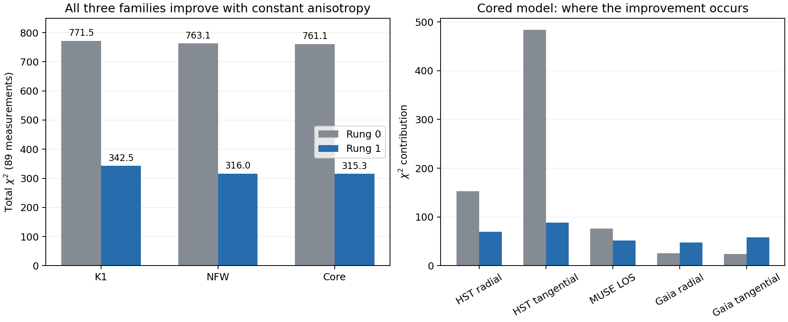
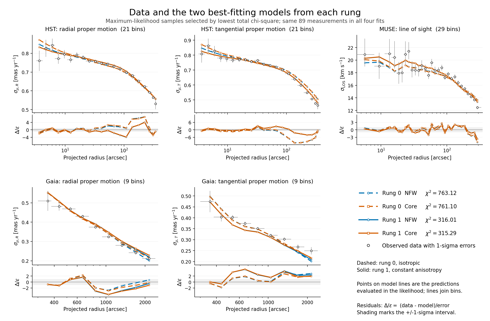
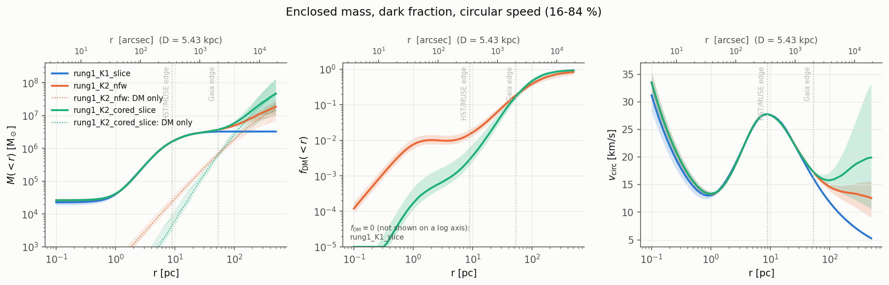
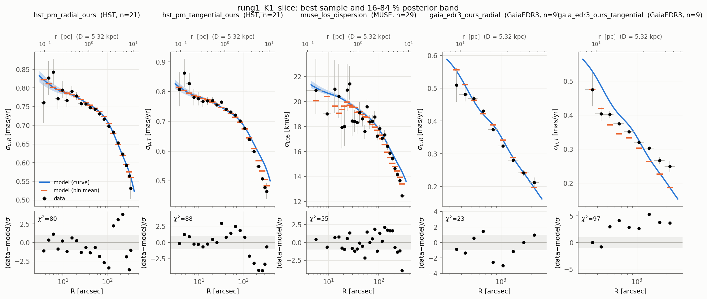
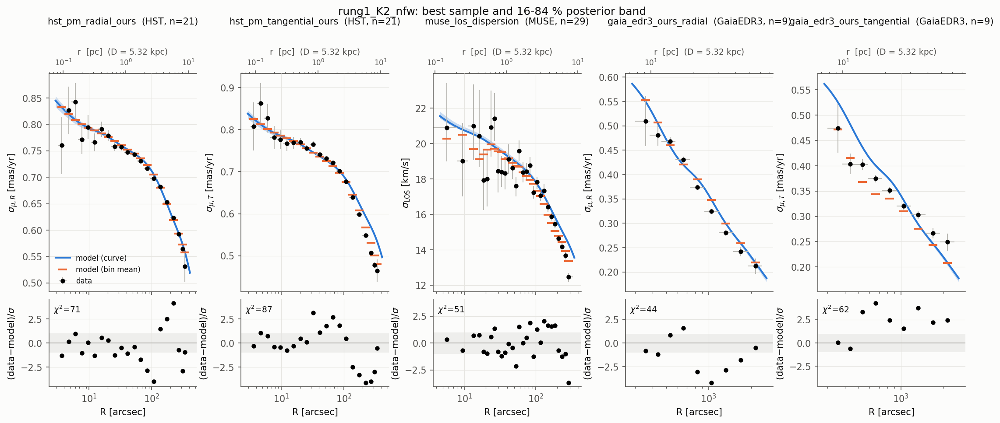
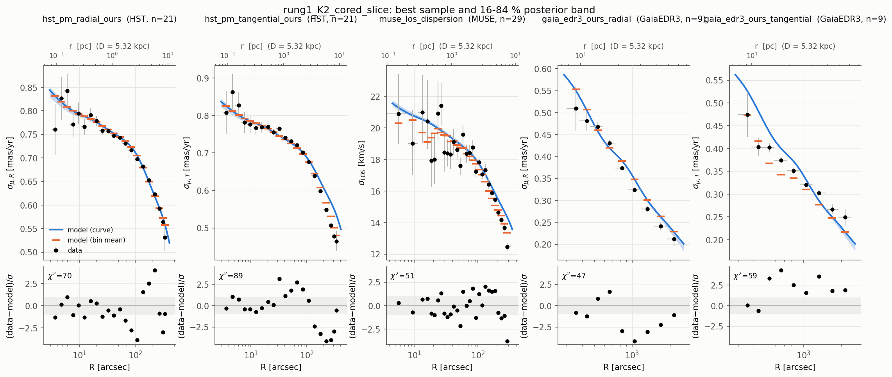

# Rung 1: all three models complete

The final cored-halo run completed successfully. Constant radial anisotropy
improves the fit substantially in all three families. These are the next
controlled baselines in the modelling ladder; the comparison remains
conditional on spherical symmetry, constant anisotropy and the current
rotation treatment.

| Family | Rung-0 χ² | Rung-1 χ² | Improvement | Rung-1 ln Z |
|---|---:|---:|---:|---:|
| K1: stars, remnants, central mass | 771.53 | 342.51 | 429.02 | 20.36 ± 0.38 |
| K2: NFW halo | 763.12 | 316.01 | 447.11 | 30.53 ± 0.41 |
| K2: cored halo | 761.10 | 315.29 | 445.81 | 31.46 ± 0.35 |

All rows use the same 89 measurements; χ² is the total, not reduced χ².
The three rung-1 likelihoods replay exactly from their saved inputs, with the
same data fingerprint. The reconstructed legacy rung-0 likelihoods also replay
and use the same data, although those older runs lack resolved input snapshots.

The cored run took 67 minutes and 820,972 likelihood calls. Its anisotropy is
β = 0.1086 [0.1040, 0.1133] (median and 16–84% interval), consistent with the
other families. Its conditional M_DM(<100 pc) posterior is
2.78 [1.79, 3.78] million solar masses, with a 95% upper limit of 4.34 million.

Cored versus NFW gives Δln Z = 0.93 ± 0.54, only a weak distinction. The
halo families improve over K1 by Δln Z = 10.18 (NFW) and 11.11 (core) within
this rung. The large improvement from rung 0 is driven mainly by the HST
tangential profile; outer Gaia residuals still show that one constant β does
not describe every radial regime. The natural next fit comparison is radial
anisotropy variation and rotation, with the rung-0 and rung-1 results retained.

## Data with the two best-fitting models from each rung

[PNG figure](../plots/rung0_rung1_data_models.png). NFW and cored are the two lowest-χ²
families in each rung. Blue denotes NFW and orange denotes the core; dashed
lines show rung 0 and solid lines show rung 1. Model markers are the actual
likelihood predictions, including the measured-star/bin averages and streaming
correction; lines connect those markers. Residuals use the same asymmetric
errors as the likelihood, with the ±1σ interval shaded. The first MUSE bin
starts at zero radius and its horizontal error bar is clipped by the log axis.

All four maximum likelihoods replay and their data fingerprints agree. The
[plotted numbers](../results/plot_data/rung0_rung1_data_models.ecsv) and
[provenance](../results/plot_data/rung0_rung1_data_models.json) are saved in
`results/plot_data/`. Regenerate
it with `PYTHONPATH=src python bin/plot_rung_data_comparison.py`.

## Posterior comparison

### Why the Gaia tangential fit worsens

Rung 1 optimises the joint likelihood. Its constant positive anisotropy improves
HST strongly, while making the Gaia tangential predictions too low over several
bins. For the cored model, the per-dataset changes are:

| Dataset | Rung-0 χ² | Rung-1 χ² |
|---|---:|---:|
| HST radial (21 bins) | 152.44 | 69.66 |
| HST tangential (21 bins) | 483.75 | 88.59 |
| MUSE LOS (29 bins) | 75.96 | 51.25 |
| Gaia radial (9 bins) | 25.38 | 47.29 |
| Gaia tangential (9 bins) | 23.56 | 58.50 |

A controlled reevaluation isolates the anisotropy effect: keep every mass
parameter and the distance at the rung-1 cored maximum-likelihood values, and
change only β from 0.10698 to zero. Gaia tangential χ² falls to **14.93**;
HST radial and tangential χ² rise to **666.41** and **362.91**. This is a
diagnostic reevaluation, not a new fit. The corresponding NFW check changes
Gaia tangential χ² from 62.23 to 17.78.

The cored rung-1 Gaia tangential residuals reach 3.32σ at 532 arcsec, 4.31σ
at 662 arcsec and 3.56σ at 1328 arcsec. The last bin is 1.91σ low; it is not
the main source of the deterioration. NFW and cored predictions are similar
over this range, so this comparison principally identifies a limitation of
constant anisotropy under the current tracer and rotation assumptions.
Radially varying anisotropy, evaluated with consistent rotation controls,
is the next comparison to test; its improvement must be measured by fitting.

The [bin-level diagnostic](../results/fits/gaia_rung_anisotropy_check_20260921.json)
records both saved fits and the fixed-mass β = 0 reevaluations.

### Saved posterior results

| quantity | rung1_K1_slice | rung1_K2_nfw | rung1_K2_cored_slice |
|---|---|---|---|
| ln Z | 20.36 ± 0.38 | 30.53 ± 0.41 | 31.46 ± 0.35 |
| Δ ln Z vs best | -11.11 | -0.93 | +0.00 |
| max ln L | 44.9 | 58.1 | 58.5 |
| χ² at max L / N | 343 / 89 | 316 / 89 | 315 / 89 |
| χ² hst_pm_radial_ours | 80 / 21 | 71 / 21 | 70 / 21 |
| χ² hst_pm_tangential_ours | 88 / 21 | 87 / 21 | 89 / 21 |
| χ² muse_los_dispersion | 55 / 29 | 51 / 29 | 51 / 29 |
| χ² gaia_edr3_ours_radial | 23 / 9 | 44 / 9 | 47 / 9 |
| χ² gaia_edr3_ours_tangential | 97 / 9 | 62 / 9 | 58 / 9 |
| likelihood calls / time | 554,515 / 39 min | 869,852 / 73 min | 820,972 / 67 min |
| M_star [Msun] | 3e+06 [2.9e+06, 3.08e+06] | 2.24e+06 [1.99e+06, 2.49e+06] | 2.47e+06 [2.22e+06, 2.72e+06] |
| M_rem [Msun] | 2.25e+05 [1.77e+05, 2.89e+05] | 7.51e+05 [5.58e+05, 9.63e+05] | 6.07e+05 [4.2e+05, 8.06e+05] |
| a_rem [pc] | 3.19 [2.7, 3.67] | 4.86 [4.46, 5.17] | 4.62 [4.1, 5] |
| M_bh [Msun] | 2.25e+04 [1.82e+04, 2.65e+04] | 2.63e+04 [2.34e+04, 2.92e+04] | 2.61e+04 [2.27e+04, 2.91e+04] |
| beta_0  | 0.105 [0.100, 0.110] | 0.108 [0.104, 0.113] | 0.109 [0.104, 0.113] |
| distance [kpc] | 5.338 [5.316, 5.360] | 5.341 [5.322, 5.360] | 5.341 [5.319, 5.361] |
| M_dm_100 [Msun] | — | 1.92e+06 [1.41e+06, 2.38e+06] | 2.78e+06 [1.79e+06, 3.78e+06] |
| r_s [pc] | — | 273 [86.8, 654] | 235 [66.2, 647] |
| M_DM(<100 pc) 95 % upper limit, rung1_K2_nfw | 2.7e+06 M☉ | | |
| M_DM(<100 pc) 95 % upper limit, rung1_K2_cored_slice | 4.34e+06 M☉ | | |

## Engine cross-check of the best samples (our Jeans solver vs JamPy)

**rung1_K1_slice**

| engine | χ² hst_pm_radial_ours | χ² hst_pm_tangential_ours | χ² muse_los_dispersion | χ² gaia_edr3_ours_radial | χ² gaia_edr3_ours_tangential | ln L |
|---|---|---|---|---|---|---|
| jeans | 79.9 | 87.7 | 54.9 | 22.8 | 97.1 | 44.85 |
| jam | 81.4 | 86.7 | 55.0 | 22.4 | 98.4 | 44.13 |

**rung1_K2_nfw**

| engine | χ² hst_pm_radial_ours | χ² hst_pm_tangential_ours | χ² muse_los_dispersion | χ² gaia_edr3_ours_radial | χ² gaia_edr3_ours_tangential | ln L |
|---|---|---|---|---|---|---|
| jeans | 71.2 | 87.4 | 50.8 | 44.4 | 62.2 | 58.11 |
| jam | 73.2 | 86.2 | 50.9 | 43.2 | 64.0 | 57.37 |

**rung1_K2_cored_slice**

| engine | χ² hst_pm_radial_ours | χ² hst_pm_tangential_ours | χ² muse_los_dispersion | χ² gaia_edr3_ours_radial | χ² gaia_edr3_ours_tangential | ln L |
|---|---|---|---|---|---|---|
| jeans | 69.7 | 88.6 | 51.2 | 47.3 | 58.5 | 58.46 |
| jam | 71.4 | 87.6 | 51.2 | 46.1 | 60.2 | 57.84 |

