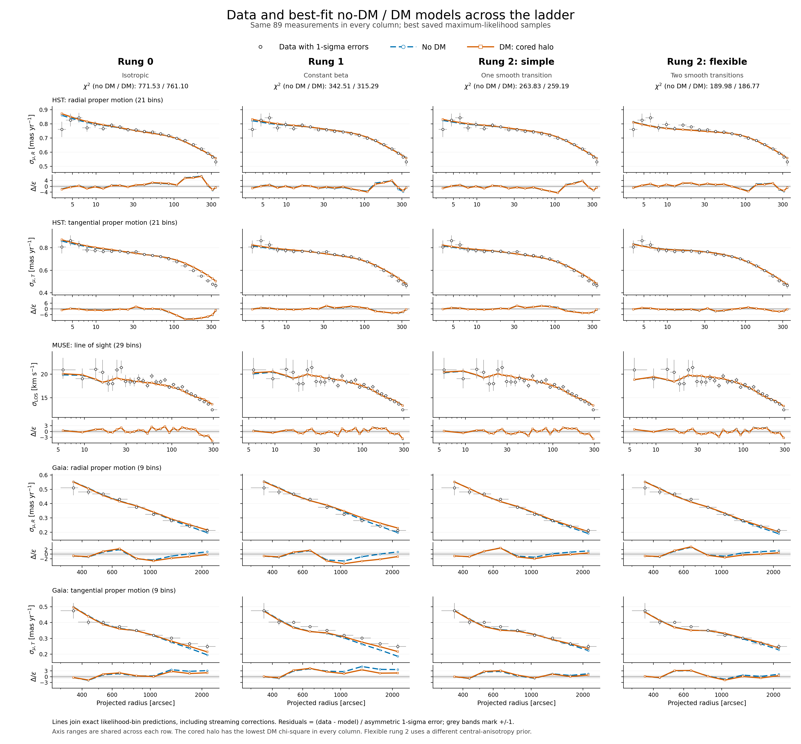

# Data and best-fit no-DM / DM models across the ladder



[Open the full-resolution PNG](../plots/rung0_rung1_rung2_no_dm_vs_dm.png).
Each column shows the best saved maximum-likelihood no-DM model and the
lowest-χ² DM family at that stage. The cored halo wins the χ² selection over
NFW in all four columns; this selection uses fit quality, not Bayesian evidence.
Rung 2 is shown separately for the simple and flexible anisotropy profiles.

| Stage | No-DM χ² | Selected DM χ² | DM family |
|---|---:|---:|---|
| Rung 0: isotropic | 771.53 | 761.10 | Cored |
| Rung 1: constant β | 342.51 | 315.29 | Cored |
| Rung 2: simple β(r) | 263.83 | 259.19 | Cored |
| Rung 2: flexible β(r) | 189.98 | 186.77 | Cored |

Blue dashed curves show no DM; orange solid curves show the selected DM
model. Black points are the same 89 observations in every column. The five
rows show HST radial and tangential proper motion, MUSE line-of-sight
dispersion, and Gaia radial and tangential proper motion. Radii are in
arcseconds; proper motions are in mas/yr and line-of-sight velocities in km/s.

Curves join the exact predictions used by the likelihood, including bin or
measured-star averaging and streaming corrections. They show best fits,
not posterior uncertainty bands. Residuals are `(data-model)/error`, using
the appropriate asymmetric error; their squared sums reproduce the reported
χ² contributions. Axis ranges are identical across each row, and grey
residual bands mark ±1. The first MUSE bin extends to zero radius; its
horizontal error bar is clipped at the logarithmic axis boundary.

All eight selected maximum likelihoods replay, and the observation
fingerprints agree. The older rung-0 models lack saved data snapshots and
use the verified legacy replay. The flexible rung-2 models use a different
central-anisotropy prior from the constant and simple models; the full
specification is in the [modelling plan](MODELLING_PLAN.md).

The [density posterior at 20 pc](DM_DENSITY_POSTERIOR.md) combines the rung-2
posterior samples using Bayesian evidence and explicit model priors, including
a probability at zero density for the no-DM alternative.

The [plotted values and residuals](../results/plot_data/rung0_rung1_rung2_no_dm_vs_dm.ecsv)
and [selection, model configuration and checksums](../results/plot_data/rung0_rung1_rung2_no_dm_vs_dm.json)
are stored outside the image-only `plots/` directory. Reproduce the figure with:

```sh
PYTHONPATH=src python bin/plot_rung_no_dm_comparison.py
```
